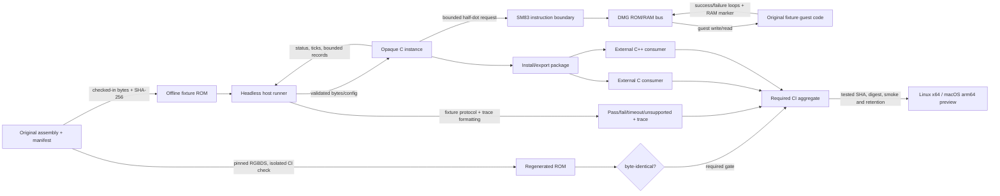

# Phase 1: Portable Foundation and Original ROM Tracer - Research

**Researched:** 2026-10-02  
**Domain:** Portable C17 library, bounded SM83/DMG guest execution, CMake package, deterministic fixtures and CI evidence  
**Confidence:** MEDIUM

<user_constraints>
## User Constraints (from CONTEXT.md)

### Locked Decisions

### Tracer startup and proof
- **D-01:** Expose one named DMG-CPU-B deterministic post-boot profile. Start cartridge execution at the documented entry point; do not ship or require a boot ROM. Reject unsupported model profiles explicitly.
- **D-02:** Use an original GabbaBoy ROM that writes a known value to guest RAM, reads and checks it, then branches to distinct success and failure loops. The headless runner recognizes the outcome from guest-visible state and retains a bounded trace. The declared opcode subset is exactly what this ROM needs; unsupported execution is explicit. Do not special-case an opcode as a hidden success signal or substitute synthetic display output for guest execution.
- **D-03:** Describe this evidence as execution of the named model/profile and fixture only. It does not establish boot, hardware-timing, full CPU, or broad game-compatibility behavior. Keep the exact post-boot values and opcode inventory tied to model-applicable evidence during planning.

### Public run and trace contract
- **D-04:** Bound public execution by a `uint64_t` half-dot tick budget, report actual ticks consumed and a structured stop reason, and preserve a strict upper bound. Stop at instruction boundaries; do not begin an instruction that would exceed the remaining budget. Document that a budget too small for the next supported instruction can return without progress.
- **D-05:** Trace output is optional, fixed-size, structured, and written into caller-owned storage. Records identify instruction-boundary time, PC/opcode bytes, and CPU state. Capacity exhaustion is explicit and never overwrites earlier records, silently drops output, or allocates. The host formats records. The core reports execution status; the headless runner interprets this fixture's success/failure protocol.
- **D-06:** Keep diagnostics and lifecycle behavior instance-owned, bounded, and free of hidden process globals. Do not expose callback reentrancy or output formatting as part of the Phase 1 API.

### Fixture build and provenance
- **D-07:** Keep the authored assembly, exact generated ROM bytes, and a fixture manifest together. Record source identity, license and notice, assembler/build recipe and version, ROM digest, model/boot applicability, result protocol, and timeout.
- **D-08:** Ordinary build/test flows use the checked-in ROM and verify its digest without needing an assembler or network. A required isolated CI check uses a pinned RGBDS release to regenerate and byte-compare the ROM. RGBDS is a fixture-verification tool only, not a core, runtime, or routine offline-build dependency. Review fixture rights separately from tool licensing; a matching hash establishes identity, not redistribution permission.

### Host checks and downloadable artifacts
- **D-09:** Require native Linux x64, macOS arm64, and Windows x64 CI coverage. Concentrate ASan/UBSan on Linux; run installed C and C++ consumer smokes on macOS and Windows. Pin explicit runner and OS floors based on the versions actually tested; make no claim for untested OS releases or architectures.
- **D-10:** Publish only Linux x64 and macOS arm64 core/runner preview packages after matching installed-package smoke succeeds. Windows is build/consumer-tested in CI but has no Phase 1 downloadable package. Attach artifacts to the tested workflow run and identify the source revision, digest, and smoke result. Disclose the retention policy; a run artifact is not a durable release archive.

### Cross-cutting preference
- **D-11:** Keep the emulator core on the C standard library only and keep dependency trees small and flat. Add a dependency only when its concrete security, readability, or evidence value justifies the cost. The accepted RGBDS use is limited to the required fixture regeneration check in CI.

### the agent's Discretion
- Resolve the precise post-boot register/device values and opcode inventory from applicable references and tests; select the immutable RGBDS and build/action pins; set supported OS floors to versions that receive actual consumer smoke; and choose field/enum names and packaging layout. Preserve the decisions above, keep tool versions fixed rather than floating, and state unverified assumptions as limitations.

### Deferred Ideas (OUT OF SCOPE)

None — discussion stayed within Phase 1 scope.
</user_constraints>

<phase_requirements>
## Phase Requirements

| ID | Description | Research Support |
|----|-------------|------------------|
| BASE-01 | A developer can configure, build, test, and install the C17 core and headless runner using documented CMake/Ninja/CTest commands without SDL or network access after explicit dependency preparation. | CMake install/export and generated-file guidance; standard-library-only core; checked-in fixture in ordinary offline build. |
| BASE-02 | An integrator can create, reset, run, and destroy independent opaque instances through a documented C API with explicit model, ownership, error, lifetime, and thread-use rules. | Instance-owned opaque API, explicit lifecycle/error/thread/pointer contracts, installed consumers. |
| BASE-03 | A caller can load a supported bounded ROM image and receive an explicit non-destructive error for truncated, oversized, unsupported, or invalid input; unsupported cartridge types are never silently guessed. | Validate lengths/header/type before mutation, cap allocations and work, reject unsupported types explicitly, preserve previous valid state on failure. |
| BASE-04 | A caller can execute a tiny original GB ROM through the real CPU/bus path with a declared opcode subset and bounded run/trace result; unsupported execution is reported explicitly and no synthetic framebuffer substitutes for guest execution. | Original fixture, source-derived opcode inventory, RAM readback branch, bounded tick/trace contract and unsupported-opcode result. |
| BASE-05 | A maintainer can reproduce each admitted public fixture from a manifest recording source, license/notice, immutable revision or original source, build recipe, digest, model/boot applicability, pass protocol, and timeout. | Co-locate authored source, bytes and manifest; check digest offline and RGBDS regeneration/byte comparison in isolated CI. |
| BASE-06 | An external C consumer and C++ consumer can link an installed `GabbaBoy::core`, execute the original tracer, and use the public header without private include paths or frontend dependencies. | Relocated install and external C/C++ consumer smokes on required native platforms. |
| BASE-07 | A contributor receives a required CI result that confirms the intended tests actually ran, including loader/lifecycle errors and ASan/UBSan coverage; missing fixtures, missing mandatory cases, failures, and timeouts cannot appear green. | Nonzero expected-test inventory, explicit aggregate result gate, Linux sanitizer lane, missing/timeout cases fail closed. |
| BASE-08 | A contributor can use a documented remote/PR workflow and download a clearly labeled foundation-preview core/runner artifact tied to its source revision, with a basic installation smoke result and honest limitations. | Revision-linked Linux x64 and macOS arm64 artifacts only after installed-package smoke; clarify CI artifact retention and current remote/credential state. |
</phase_requirements>

## Summary

Plan the first vertical slice around one authored ROM and one installable consumer path: a standard-library-only C17 core, a small opaque instance API, a bounded ROM-only cartridge loader, a headless runner and a bounded instruction-boundary trace. Keep the API's actual `uint64_t` half-dot budget and strict no-overshoot rule central to task and test design. The guest program should initialize the state it relies on, store a known RAM value, read and compare it, leave distinct success/failure guest-visible outcomes, and loop; runner logic interprets only this known fixture protocol. Unsupported execution must remain an ordinary explicit error, never a success signal.

Model references identify useful CPU and I/O handoff values for DMG, but Pan Docs explicitly warns that some post-boot fields are volatile and WRAM/HRAM begin random on hardware. Treat the profile as a deterministic emulator startup contract with named DMG-CPU-B applicability, not as proof that the emulator ran Nintendo's boot ROM or reproduces every analog/device startup effect. Fix only the state the core and fixture need, and initialize all fixture working memory/registers explicitly. Pin tools and publishable floors after successful local/native smoke, recording exact revision/hash and actual tested platform evidence.

**Primary recommendation:** establish the minimal CMake 3.25/schema-6 core and runner targets plus target-based tracer smoke in the first vertical slice, then expand the public contract and tests, install/export and external consumers, required CI inventory/sanitizers/floor lane, and revision-linked package and remote/PR setup. A plan is complete only when each required automated case ran on the revision/artifact it claims to qualify.

## Architectural Responsibility Map

| Capability | Primary Tier | Secondary Tier | Rationale |
|------------|-------------|----------------|-----------|
| CPU/bus/profile execution and trace capture | API / Backend (portable core) | — | Deterministic guest state and bounded emulated time belong to the instance-owned core; no host clock or formatting. |
| ROM loading, header/type validation and fixture result interpretation | API / Backend | Browser / Client (headless host runner) | Core owns validated machine state; the runner owns host file access and knows this fixture's pass/fail protocol. |
| Build/install/export and consumer integration | API / Backend | — | CMake package exports public headers/target; clean downstream projects verify installed contract. |
| Test inventory, sanitizers and artifact publication | CDN / Static (CI/artifact service) | API / Backend | CI proves exact build/test results and stores packages; core remains dependency-free. |

## Standard Stack

### Core

| Library/tool | Version | Purpose | Why Standard |
|---------|---------|---------|--------------|
| ISO C | C17 | Portable core, API and runner | Accepted project baseline. Use fixed-width guest state, explicit byte decoding, target-scoped warnings and standard library only. `[CITED: https://cmake.org/cmake/help/latest/prop_tgt/C_STANDARD.html]` |
| CMake | Minimum 3.25 with committed preset schema 6; Plan 04 pins CMake 3.25.3 and official Linux x64 archive SHA-256 for the floor lane | Configure, build, install/export | This is the project stack contract. Do not state the floor is supported until 3.25.3 passes preset configure, build, CTest, install, relocation, and external consumers. `[CITED: https://cmake.org/cmake/help/latest/manual/cmake-presets.7.html]` |
| Ninja + CTest | Exact version to record after CI smoke | Build and run named cases | Small conventional C build/test path; report named tests and assert expected inventory instead of trusting a green zero-test filter. `[CITED: https://cmake.org/cmake/help/latest/guide/tutorial/Installation%20Commands%20and%20Concepts.html]` |
| RGBDS | Pin released `v1.0.1` as the starting candidate; current official manual identifies it as latest stable, but validate regeneration against the fixture before locking | Isolated fixture regeneration only | Official RGBDS history provides immutable release versions and language/opcode reference; keep it out of core/runtime/ordinary offline build. `[CITED: https://rgbds.gbdev.io/versions]` |

### Supporting

| Tool | Version | Purpose | When to Use |
|---------|---------|---------|-------------|
| Clang ASan + UBSan | Pin actual CI image/compiler; do not claim a compiler floor from hosted image alone | Memory/undefined-behavior checks | Linux sanitizer job, including loader/lifecycle and tracer cases. Set UBSan to fail on findings. `[CITED: https://clang.llvm.org/docs/AddressSanitizer.html]` `[CITED: https://clang.llvm.org/docs/UndefinedBehaviorSanitizer.html]` |
| GitHub Actions hosted runners | Explicit image labels for Linux x64, macOS arm64, Windows x64; select after running the consumer smoke | Required multi-OS evidence | Use fixed labels, not `-latest`; OS image labels and product minimum-OS/deployment floors are distinct. Current runner matrix changes over time. `[CITED: https://docs.github.com/en/actions/reference/runners/github-hosted-runners]` |
| GitHub workflow artifacts | Pin actions by reviewed full commit SHA at implementation time | Attach tested preview packages and smoke record | Use artifact URL/run and report retention; not a permanent release archive. Current upload-artifact documentation exposes digest and retention settings. `[CITED: https://github.com/actions/upload-artifact]` |

### Alternatives Considered

| Instead of | Could Use | Tradeoff |
|------------|-----------|----------|
| Checked-in ROM + isolated regenerate/compare | Assemble fixture in every normal build | Adds an assembler/network/toolchain dependency to routine offline work, contrary to D-08. |
| Direct small C interpreter for this slice | Generated opcode framework or external CPU package | More machinery than the exact tiny subset needs and weakens ownership/readability; no full CPU dependency is accepted. |
| Run-boundary host timestamp/wall clock | Core-owned wall clock | Breaks deterministic emulated-time contract and portability; return emulated ticks only. |
| CI run artifact for foundation preview | Permanent release archive | Run artifacts have configured retention; durable archive is a later separate delivery promise. |

**Installation:** No core package manager dependencies. Developer prerequisites are a C17 compiler, CMake, Ninja and Git; CI additionally obtains its pinned RGBDS release and pinned Actions. Document versions and preparation; ordinary build and test consume the checked-in ROM offline.

**Version verification:** Recheck exact release and action commits when implementing because those facts change. RGBDS official versions currently lists `1.0.1` dated 2026-01-01 and labels it the latest stable release. An authoritative current doc cannot determine GabbaBoy's compatible action commit, oldest supported host OS or minimum deployment target: lock those after reproducible build and successful native C/C++ installed-consumer smoke. `[CITED: https://rgbds.gbdev.io/versions]`

## Package Legitimacy Audit

This phase adds no C runtime package and no ecosystem package-manager dependency. RGBDS is a CI-only external assembler distributed by its official project; pin its official release source/binary and verify its provenance and version. Actions are workflow dependencies: pin each to a reviewed immutable full SHA and inspect its source/permissions at implementation. Do not select a third-party package based only on registry existence. `[CITED: https://rgbds.gbdev.io/install]` `[CITED: https://docs.github.com/en/actions/reference/security/secure-use]`

| Package/tool | Registry/source | Legitimacy | Disposition |
|---------|------------------|-------------|-------------|
| RGBDS | Official RGBDS releases/docs | Official project release; candidate `v1.0.1`; verify artifact checksum and successful byte-for-byte regeneration | CI fixture verification only; no runtime dependency |
| GitHub Actions used for checkout/build/artifact | Official action repositories | Exact current action SHAs are not yet selected or smoke-tested | Planner should make explicit SHA pinning a task and document update process |

**Packages removed due to [SLOP] verdict:** none.  
**Packages flagged as suspicious [SUS]:** none.  
**Package audit note:** no npm/PyPI/crates package install is recommended; choose no external C runtime library.

## Architecture Patterns

### System Architecture Diagram



### Recommended Project Structure

```text
include/gabbaboy/       # public self-contained C API
src/core/               # instance-owned CPU, bus, cartridge, bounded stepping
src/runner/             # host file I/O and fixture-specific result protocol
tests/                  # loader/lifecycle/API, tracer, external consumer projects
fixtures/tracer/        # assembly, checked ROM bytes, license/notice, manifest
cmake/                  # install/export package config and test helpers
.github/workflows/      # pinned actions, native CI, RGBDS regeneration, artifact job
```

### Pattern 1: Derive the tracer opcode set from the assembled fixture

**What:** Keep a deliberately tiny instruction implementation and make the fixture's complete reachable instruction set an explicit reviewed manifest/table. Assemble to a fixed binary, disassemble/source-audit every instruction and branch target, and make each opcode handler exercise instruction length, register changes, memory access and half-dot cost as one implementation unit. RGBDS reference explicitly documents opcode bytes, machine-cycle cost and flags. `[CITED: https://rgbds.gbdev.io/docs/v1.0.1/gbz80.7]`

**When to use:** Only for the original bounded RAM round-trip tracer in this phase. Do not turn this inventory into a promise to implement the general CPU or treat future unsupported opcodes as success.

**Planning candidate:** `LD SP,d16`, `LD HL,d16`, `LD A,d8`, `LD [HL],A`, `LD A,[HL]`, `CP d8`, `JR NZ,r8`, `JR r8`. This is a candidate instruction-family list, not a verified final inventory: make the authored source/assembled bytes determine the final exact opcodes, including boot entry/header bytes and any loops. Give success and failure separate guest-visible RAM markers or states so the runner can identify result without an opcode trap. The runner's decoder must be exact to fixture identity and never affect core semantics. `[ASSUMED]`

### Pattern 2: Instruction-atomic budget and caller-owned trace

**What:** At an instruction boundary, decode enough to determine support and full instruction cost. If the instruction cost exceeds remaining budget, return without starting it; otherwise complete its instruction and bus effects, advance actual emulated half-dot ticks, then append one fixed-size trace record if capacity remains. Capacity exhaustion is a structured result and must not mutate/overwrite earlier records. The chosen convention needs exact API documentation for zero-progress returns and simultaneous stop conditions. `[CITED: .planning/phases/GB-01-portable-foundation-and-original-rom-tracer/01-CONTEXT.md:21-24]`

**When to use:** Every public run call, whether trace capture is enabled or not. Current phase has no display/audio outputs to wait on.

### Pattern 3: Installed consumer as package acceptance test

**What:** Install to a temporary prefix, move/use that prefix from an independent project, resolve the exported namespaced target, compile both C and C++, and run the real tracer. Do not allow source-tree headers or private CMake paths into the consumer. CMake's install/export guide describes exporting targets for downstream projects. `[CITED: https://cmake.org/cmake/help/latest/guide/tutorial/Installation%20Commands%20and%20Concepts.html]`

## Don't Hand-Roll

| Problem | Don't Build | Use Instead | Why |
|---------|-------------|-------------|-----|
| Package install/export mechanics | Custom path-copying package system | CMake `install()`/exported target and package config | CMake supplies standard downstream target consumption; relocation test proves project configuration. `[CITED: https://cmake.org/cmake/help/latest/guide/importing-exporting/index.html]` |
| Assembly | Hand-encode the ROM as the only source | RGBDS source plus checked binary and hash | Source is reviewable and release tool supports the architecture; ordinary build remains offline. `[CITED: https://rgbds.gbdev.io/versions]` |
| Trace text/reporting | `printf`/formatting inside core | Fixed structured caller buffer; host runner formats | Avoids allocation, global output and presentation coupling; makes overflow explicit. `[CITED: .planning/phases/GB-01-portable-foundation-and-original-rom-tracer/01-CONTEXT.md:21-24]` |
| Universal CPU coverage | General decoder framework for one fixture | Direct small switch/table with explicit unsupported result | Keeps scope proportional and behavior auditable; exact fixture is the contract. `[ASSUMED]` |

**Key insight:** The proof comes from a guest-produced RAM result and bounded, inspectable instruction/bus history. A test-only breakpoint, synthetic frame or runner-only success code would disconnect the result from execution.

## Common Pitfalls

### Pitfall 1: Treating a post-boot table as universal hardware state

**What goes wrong:** Startup assumes values that vary with model, header contents, elapsed boot timing, or uninitialized memory; a deterministic emulator profile is then misreported as hardware-verified.

**Why it happens:** The profile skips the boot ROM but inherits an expectation that boot always leaves every register/device in one universal state.

**How to avoid:** Restrict model to DMG-CPU-B; state profile values and unknown/excluded fields explicitly. Pan Docs records DMG CPU defaults (A=01, B=00, C=13, D=00, E=D8, H=01, L=4D, PC=0100, SP=FFFE). Flags are Z=1 and N=0; H and C are clear when the header checksum is zero and both set otherwise, giving F=0x80 for checksum zero and F=0xB0 otherwise. For DMG/MGB hardware I/O handoff, DIV is AB and STAT is 85, but timing-sensitive records are at PC=0100 and some boot duration depends on header. WRAM/HRAM are random on power-up. Pick a fixed valid authored header, initialize working RAM/registers the fixture relies on, and document profile-defined RAM fill as an emulator policy, not a DMG observation. `[CITED: https://raw.githubusercontent.com/gbdev/pandocs/master/src/Power_Up_Sequence.md]`

**Warning signs:** tests depend on RAM contents before a guest write; flag values are copied from a different checksum; claim says “booted a DMG” though no boot path ran.

### Pitfall 2: Wrong half-dot accounting or overshooting a budget

**What goes wrong:** Return reports more ticks than requested, starts an instruction it cannot finish, or counts opcode fetch and memory access inconsistently.

**Why it happens:** Ambiguous “cycles” or subtract-after-execute control flow obscures instruction atomicity.

**How to avoid:** Name units `half_dots`; for DMG, one dot is two half-dot ticks and one normal-speed M-cycle is eight. Test budget zero, one less/equal/one more than each supported instruction cost, multiple instructions ending exactly at budget, and too-small-for-next-instruction with unchanged CPU/bus state. Return actual ticks consumed. `[CITED: .planning/research/ARCHITECTURE.md:45-61]`

**Warning signs:** fractional instruction timing leaks into caller contract; cycle count asserted only after whole fixture; loop has no finite emulated budget or host watchdog.

### Pitfall 3: Circular or hidden fixture oracle

**What goes wrong:** Runner marks success because it sees an opcode, state, or bytes that the emulator implementation itself emits as a shortcut.

**Why it happens:** Expected outcome is derived from the same code path or protocol is global instead of fixture-scoped.

**How to avoid:** Independently specify address/value/check/branch/loop results from assembly source and assembled ROM. Runner recognizes its named fixture's RAM marker or loop state only; core implements normal instructions. Add negative controls for a corrupted RAM read, wrong compare/branch behavior, unsupported opcode, failure marker, and timeout; each must cause its expected non-pass status. Mooneye's special `LD B,B` protocol is explicitly scoped to Mooneye fixtures, illustrating why it must not become a global CPU success signal. `[CITED: https://github.com/Gekkio/mooneye-test-suite#passfail-reporting]`

**Warning signs:** changing an opcode handler also changes the expected fixture output automatically; test inventory does not prove the named case ran.

### Pitfall 4: Offline build accidentally acquires tool/network dependency

**What goes wrong:** clean build fetches RGBDS, SDL, generated test data or a floating action/package version.

**Why it happens:** fixture reproduction was wired as a normal build dependency rather than a distinct CI verification target.

**How to avoid:** Hash-check checked-in fixture bytes in normal tests. Keep RGBDS fetch/install in isolated CI regeneration lane, pin its released version, regenerate and byte-compare; make network and package install explicit prerequisites. `[CITED: .planning/phases/GB-01-portable-foundation-and-original-rom-tracer/01-CONTEXT.md:26-35]`

**Warning signs:** build invokes `FetchContent`/network by default; core links SDL; default CTest needs assembler.

### Pitfall 5: Green CI with skipped evidence or unrelated artifact

**What goes wrong:** CI passes when expected tests did not run, fixture disappeared, sanitizer lane skipped, or package comes from a different SHA than tested.

**Why it happens:** workflow trusts job status without validating expected inventory and provenance.

**How to avoid:** A required aggregate gate enumerates mandatory job/test outputs and fails on missing/skip/failure/timeout; compare fixture hash, source SHA, package digest, installed consumer smoke and artifact upload run. Pin action full SHAs. Test explicit runner labels and supported OS floors only. GitHub artifacts have a retention period and are run-scoped; disclose actual retention and never call them durable. `[CITED: https://docs.github.com/en/pull-requests/how-tos/merge-and-close-pull-requests/troubleshooting-required-status-checks]` `[CITED: https://github.com/actions/upload-artifact]`

**Warning signs:** workflow uses `*-latest`, bare “green” without test list, smoke runs source-tree binary only, artifact built on a newer SHA.

## Code Examples

Verified instruction semantics from the official RGBDS manual (the exact bytes remain source/assembler output and must be checked against the fixture manifest):

```asm
; Pseudocode for the accepted fixture shape; labels/addresses and final bytes
; are implementation choices that must be frozen in source + manifest.
    ld   sp, $DFFF
    ld   hl, result_address
    ld   a, known_value
    ld   [hl], a
    ld   a, [hl]
    cp   known_value
    jr   nz, failure
success:
    ld   a, success_marker
    ld   [hl], a
    jr   success
failure:
    ld   a, failure_marker
    ld   [hl], a
    jr   failure
```

`LD r16,n16`, `LD [HL],A`, `LD A,[HL]`, `CP n8` and relative `JR` are normal documented Game Boy CPU instructions with explicit byte/cycle metadata in RGBDS. Ensure header and entry trampoline are included in the reviewed binary inventory; actual placement can affect required instruction forms. `[CITED: https://rgbds.gbdev.io/docs/v1.0.1/gbz80.7]`

## State of the Art

| Old Approach | Current Approach | When Changed | Impact |
|--------------|------------------|--------------|--------|
| Depend on the original Nintendo boot ROM for startup tests | Name a deterministic post-boot state contract for the bounded tracer; boot-ROM execution is excluded | Phase 1 locked decision | No copyrighted boot ROM is shipped/required; evidence scope must say post-boot profile. `[CITED: https://github.com/gbdev/pandocs/blob/master/src/Power_Up_Sequence.md]` |
| Assume “latest” runner or action tags remain fixed | Use explicit image labels and immutable full-SHA action pins, update deliberately | Current GitHub guidance; verify again at implementation | Reproducible workflow refs, but hosted image contents still evolve; record actual tested image/tool versions. `[CITED: https://docs.github.com/en/actions/reference/security/secure-use]` |
| Assemble fixture during every build | Check in generated bytes, hash them on normal/offline path, regenerate in isolated required CI | Locked D-08 | Reproducible provenance without daily assembler dependency. `[CITED: .planning/phases/GB-01-portable-foundation-and-original-rom-tracer/01-CONTEXT.md:26-35]` |

**Deprecated/outdated:** Floating `*-latest` runner labels and mutable action version tags are unsuitable for a locked verification recipe; keep a separate reviewed pin-update task. `[CITED: https://docs.github.com/en/actions/reference/security/secure-use]`

## Assumptions Log

| # | Claim | Section | Risk if Wrong |
|---|-------|---------|---------------|
| A1 | Candidate tracer opcode families are sufficient for selected source, entry/header layout, RAM markers and loops | Architecture Patterns / Code Examples | Missing instruction forces redesign or hidden workaround; finalize via assemble + disassembly before implementation task assignment. |
| A2 | RGBDS `v1.0.1` tool and chosen distribution can be made byte-stable across required CI host | Standard Stack | Generated bytes differ due tool/input/build metadata or artifact host; test canonical generation and commit expected bytes before pin lock. |
| A3 | Linux x64 and macOS arm64 package formats and Windows native consumer compilation can be smoke-tested on available CI/owner platforms | Validation / Environment | Tool/credential/runner access could delay artifact task; report missing evidence and do not claim target support. |
| A4 | Fixture result protocol should use a RAM marker that runner reads from guest-visible machine state | Pattern 1 / Pitfalls | If public core intentionally omits peek/read API, runner can use exposed trace/state boundary or a narrowly scoped host result interface without test-only CPU semantics. |

## Open Questions

1. **Which exact deterministic profile fields are part of the public contract?**
   - What we know: DMG register and selected I/O values at cartridge handoff are documented, with some header/timing dependencies; RAM contents are not deterministic on real hardware.
   - What's unclear: Which I/O devices must be modeled versus initialized to profile values for this tracer, and what deterministic RAM-fill policy is appropriate.
   - Recommendation: Make the exact contract a planning deliverable. Set CPU registers/PC/SP and modeled boot-relevant I/O explicitly; mark unmodeled values unsupported/unspecified and guest-initialize RAM. Distinguish synthesized profile from boot execution.

2. **What exact OS floors and action SHAs can be promised?**
   - What we know: Current GitHub-hosted runner docs list explicit OS labels; artifact upload exposes digest/retention. A workflow image is not proof of oldest supported host OS.
   - What's unclear: The oldest Linux/macOS/Windows versions that actual installed packages and consumers run on, plus exact reviewed action commit SHAs.
   - Recommendation: Pin current explicit runner labels for test lanes, execute native installed-package C/C++ smoke, then declare product OS floors only to tested versions. Lock action full SHAs after inspecting official repo source and test workflow.

3. **How will the owner enable remote checks/artifacts?**
   - What we know: Context states there is no configured Git remote, so no live PR required-check or hosted artifact evidence exists.
   - What's unclear: Repository host, remote access, branch protection and credentials.
   - Recommendation: Plan CI/workflow and artifact implementation; record setup/access limitation honestly. No external remote or credential is established by this research.

## Environment Availability

| Dependency | Required By | Available | Version | Fallback |
|------------|------------|-----------|---------|----------|
| Installed OpenGSD runtime | Planning research/init | ✓ | `@opengsd/gsd-core` 1.15.0 (verified by `gsd_run runtime-identity` on 2026-10-02) | — |
| Local source/compiler/build tools | Future implementation | Not probed for this research assignment | — | Explicit dependency-preparation task before build |
| GitHub-hosted native Linux x64, macOS arm64, Windows x64 | Required CI | Not available in repository context; no remote configured | — | Do not report CI evidence until repository remote/workflow is active |
| RGBDS official release | Fixture regeneration lane | Not installed/probed; not needed for ordinary build | Candidate 1.0.1 per official docs | Isolated pinned CI setup; checked ROM/hash supports offline tests |

**Missing dependencies with no fallback:** Hosted CI and remote are prerequisites for live required-check/artifact evidence; plan setup and leave evidence explicitly pending if access is unavailable.

**Missing dependencies with fallback:** RGBDS absence locally is acceptable for ordinary checked-ROM digest/tests; isolated regeneration must run in CI before phase proof is complete.

## Validation Architecture

`.planning/config.json` was read this session and says `"nyquist_validation": true` and `"security_enforcement": true` (`.planning/config.json:20-50`). Include automated validation tasks. No implementation exists yet; the Phase 1 plan establishes the CMake/CTest path in Plan 01 Task 1 and expands its suite in Plan 02, rather than assuming a separate Wave 0.

### Test Framework

| Property | Value |
|----------|-------|
| Framework | CTest via CMake (recommended baseline; no framework exists yet) |
| Config file | Minimal C17 `CMakeLists.txt` targets and tracer CTest in Plan 01 Task 1; expanded test targets in Plan 02 |
| Quick run command | `cmake -S . -B build -G Ninja && cmake --build build && ctest --test-dir build --output-on-failure --no-tests=error` |
| Full suite command | `ctest --test-dir build --output-on-failure` plus separate native consumer/sanitizer/RGBDS CI lanes |

### Phase Requirements → Test Map

| Req ID | Behavior | Test Type | Automated Command | File Exists? |
|-------------|----------|-----------|-------------------|-------------|
| BASE-01 | Core/headless configure-build-test-install without SDL/network after prep | integration | Plan 01 tracer configure/build/test, then documented install flow | ❌ Plan 01 / Plan 03 |
| BASE-02 | independent instances, lifecycle/reset, errors, thread/lifetime docs | unit/integration | CTest lifecycle/API cases | ❌ Plan 02 |
| BASE-03 | malformed/truncated/oversized/unsupported ROM errors preserve current state | unit/fuzz regression | CTest loader cases; bounded fuzz harness later only if in-scope | ❌ Plan 02 |
| BASE-04 | real ROM writes/reads RAM, compares/branches, trace bounded, unsupported opcode explicit | integration | Target-based CTest tracer case plus failure/timeout/unsupported controls | ❌ Plan 01 / Plan 02 |
| BASE-05 | fixture rebuild equals checked bytes and manifest hash | reproducibility | Isolated pinned RGBDS job; CMake-native offline `fixture_digest` using built-in hashing/JSON support | ❌ Plan 01 / Plan 04 |
| BASE-06 | installed C and C++ consumers and installed runner execute fixture without private includes | integration | Relocated installed-runner and standalone C/C++ consumer smokes per native OS | ❌ Plan 03 |
| BASE-07 | named expected cases actually execute and sanitizer/loader/lifecycle gates fail closed | CI contract | required aggregate job checks explicit test inventory and job results | ❌ Plan 04 |
| BASE-08 | full installed-tree artifact smoke corresponds to exact tested source/digest and labels limitations | release smoke | extract exact tar artifact and run installed runner/consumer smoke | ❌ Plan 05 |

### Sampling Rate

- **Per task commit:** targeted CTest case(s) named by each task.
- **Per wave merge:** full CTest inventory and external install consumer(s) affected by the wave.
- **Phase gate:** required CI aggregate green on exact revision; native three-platform consumers, Linux ASan/UBSan, fixture regeneration equality and artifact smoke/provenance all present. A skipped lane is not passing evidence.

### Plan Sequencing

- [ ] Plan 01 Task 1: minimal CMake project with C17 core/runner targets and target-based tracer smoke before later CMake commands.
- [ ] Plan 03: GNUInstallDirs install/export config for public core/header, runner, and fixture files.
- [ ] Public C header and tiny C/C++ external consumer fixtures.
- [ ] Test oracle: independent source-derived tracer expected data and negative controls.
- [ ] Sanitizer build and explicit expected-test inventory/aggregate gate.
- [ ] Fixture source/bytes/license-notice/manifest plus CMake-native offline SHA check and RGBDS regen comparison; no Node dependency.
- [ ] Native workflow, pinned actions, supported tested OS floors and artifact smoke.

## Security Domain

Security enforcement is enabled at configured ASVS level 1 (`.planning/config.json:48-50`). ASVS is a web-app standard and maps imperfectly to a C library; apply relevant input/data integrity ideas, and record non-applicable web controls rather than adding web dependencies. Current ASVS 5 names encoding/sanitization in V1; this is an edition-mapping change from older V5 labels, so identify the selected version when planning controls. `[CITED: https://owasp.github.io/www-project-application-security-verification-standard/]` `[CITED: https://github.com/OWASP/ASVS/blob/master/5.0/en/0x10-V1-Encoding-and-Sanitization.md]`

### Applicable ASVS Categories

| ASVS Category | Applies | Standard Control |
|---------------|---------|-----------------|
| Input validation / V1 (ASVS 5; analogous V5 in older edition) | yes | Check buffer lengths before reads, cap ROM size/work, validate declared cartridge type/header, reject unsupported content and preserve active state on failure. |
| Data protection / integrity (edition-specific category) | yes | Hash checked-in fixture; keep private data and secrets out of artifacts; verify artifact/source digest and provenance. |
| Authentication / session / access control | no for the local core contract | No user identity or service session in the emulator core; CI repository permissions still minimal and read-only for ordinary PR jobs. |
| Cryptography | limited | Use established SHA-256 implementation/tool for fixture/artifact identity; do not design encryption or roll custom cryptography. |

### Known Threat Patterns for portable C + Actions

| Pattern | STRIDE | Standard Mitigation |
|---------|--------|---------------------|
| Crafted ROM length/header causes overflow, truncation or huge allocation | Tampering / DoS | Checked arithmetic, explicit maximum, parse into temporary state, bounded work and regression tests. |
| Unsupported opcode or guest loop causes unbounded host work | DoS | Instruction-supported check, half-dot budget, host watchdog; timeout distinct from pass. |
| Trace capacity exceeded or caller passes invalid storage | Tampering / DoS | Validate pointer/capacity pair; no allocation/drop/overwrite; explicit stop/error result. |
| Untrusted PR payload executes in privileged workflow or action ref moves | Elevation of privilege / Tampering | `pull_request`, minimal token permissions, no privileged fork execution, full SHA action refs and required exact-head checks. `[CITED: https://docs.github.com/en/actions/reference/security/secure-use]` |
| Fixture/build/artifact mismatch creates false provenance | Repudiation / Tampering | SHA-256 manifest, byte-compare regenerated fixture, source SHA + package digest + smoke result in same run. |

## Project Constraints (from AGENTS.md)

- Target Game Boy and Game Boy Color; copied NES/Neo Geo/Elixir examples are not implementation requirements. Never claim unimplemented emulator functionality.
- Use installed `@opengsd/gsd-core`; preserve phase boundaries; keep `workflow.auto_advance` and `workflow._auto_chain_active` false.
- Use phase branches when a remote exists; never bypass branch protection or treat skipped/stale/local checks as remote proof. The phase-plan branch invariant in this assignment also prohibits creating/switching branches for this research task.
- Automate repeatable verification; state actual hardware/credential limitations instead of inventing manual UAT.
- Keep main releasable and update docs/examples/tests/limitations with behavior changes; inspect current evidence and requirement traceability before completion.
- Implement original portable C with explicit ownership/errors, bounded public operations and no hidden globals; host timing/filesystem/UI/audio/environment stay in adapters.
- Prefer small direct code; explain hardware reasons and invariants; require evidence before performance complexity.
- Bound ROM/save/state sizes, allocation and guest work; reject truncation/overflow/partial mutation; serialize explicit fields, never raw structs.
- Label hardware-backed, differential, metamorphic, regression and private-game evidence distinctly; document model applicability/exclusions/expected failures.
- Do not add Nintendo boot ROMs, commercial images, unlicensed homebrew, private data or mandatory telemetry. Third-party fixture needs redistribution rights and digest.
- Keep secrets in ignored `.env.local` or scoped CI secrets; do not publish home paths/emails/machine IDs/secret values; use privacy-safe Git author.
- Preserve `.planning/research/INDEX.md`, update lessons with concrete evidence during implementation, and do not call a phase complete from documents/tests lists/plausible output alone.

## Sources

### Primary / official project and documentation (MEDIUM confidence through websearch classifier)

- [Pan Docs power-up sequence](https://github.com/gbdev/pandocs/blob/master/src/Power_Up_Sequence.md) — handoff register and hardware I/O state; volatility caveats; links to Mooneye confirmations.
- [RGBDS version history](https://rgbds.gbdev.io/versions) and [v1.0.1 GBZ80 manual](https://rgbds.gbdev.io/docs/v1.0.1/gbz80.7) — release versions, bytes/cycles/flags.
- [Mooneye Test Suite README](https://github.com/Gekkio/mooneye-test-suite) — author-provided model naming and fixture pass/fail protocol; test-authored evidence, not hardware measurement by this research.
- [CMake install/export guide](https://cmake.org/cmake/help/latest/guide/tutorial/Installation%20Commands%20and%20Concepts.html) and [importing/exporting guide](https://cmake.org/cmake/help/latest/guide/importing-exporting/index.html) — package integration mechanism.
- [GitHub-hosted runners](https://docs.github.com/en/actions/reference/runners/github-hosted-runners), [secure use](https://docs.github.com/en/actions/reference/security/secure-use), and [`upload-artifact`](https://github.com/actions/upload-artifact) — changing image inventory, pin/security practices and artifact digest/retention.
- [OWASP ASVS project](https://owasp.github.io/www-project-application-security-verification-standard/) — current version/evidence framework; applicability to standalone native core is limited.

### Project evidence (read this session)

- `.planning/phases/GB-01-portable-foundation-and-original-rom-tracer/01-CONTEXT.md` — locked phase scope, decisions and discretion.
- `.planning/REQUIREMENTS.md` — BASE-01 through BASE-08 exact requirement text.
- `.planning/research/INDEX.md`, `SUMMARY.md`, `ARCHITECTURE.md`, `HARDWARE-AND-VALIDATION.md`, `PITFALLS.md`, `STACK.md`, `QUALITY-AND-DELIVERY.md` — project-specific accepted research, evidence limits and recommendations.
- `AGENTS.md`, `.planning/config.json`, `.planning/STATE.md`, `.planning/PROJECT.md`, `.planning/ROADMAP.md` — constraints, current status and validation/security toggles.

### Evidence distinctions and limitations

- **Source/hardware synthesis:** Pan Docs aggregates disassembly analysis and cited Mooneye tests/hardware observations. Its own warning says some handoff details are volatile; use only its stated scope.
- **Test-author protocol:** Mooneye documents how its ROMs report results. This protocol validates only a fixture when that fixture is deliberately run; it is not a general hardware oracle.
- **Differential inference:** Agreement between emulator implementations can identify likely defects, but cannot independently establish hardware truth.
- **Implementation recommendation:** strict budget tests, guest RAM result markers, negative controls, native consumer smokes and aggregate CI are proposed acceptance design, not existing GabbaBoy behavior.
- Repository currently has no emulator source, CMake project, fixture, tests, workflow or configured remote. No runtime functionality, actual CI evidence, native OS support floor or successful artifact smoke is claimed.

## Metadata

**Confidence breakdown:**
- Standard stack: MEDIUM — project baseline is clear; immutable action pins and OS floors need successful native smoke.
- Architecture: MEDIUM — local decisions strongly constrain the design; exact fixture opcodes must derive from the assembled source and startup contract.
- Pitfalls: MEDIUM — primary Pan Docs/RGBDS/GitHub sources and project evidence support the recommendations; no hardware run or implementation was performed.

**Research date:** 2026-10-02  
**Valid until:** Recheck GitHub runner/action and ASVS versions at implementation; stable CPU/profile citations should be revisited if fixture or model evidence changes.
