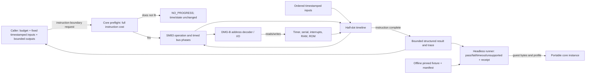

# Phase 2: DMG CPU, Bus, and Time - Research

**Researched:** 2026-10-06  
**Domain:** DMG-CPU-B SM83 execution, CPU-visible bus, timer, deterministic bounded stepping, and CPU/timer diagnostic corpus  
**Confidence:** MEDIUM

<user_constraints>
## User Constraints (from CONTEXT.md)

### Locked Decisions
- **D-01:** Implement every documented legal base and CB SM83 opcode for the declared DMG-CPU-B profile, including flag results, arithmetic, address effects, and tested bus-access timing. Cover interrupt entry, delayed EI enable, HALT and HALT-bug behavior, STOP, reset, and deterministic post-boot state as required by CPU-01/CPU-02.
- **D-02:** Treat unused opcodes as the profile's persistent CPU lockup. Surface a distinct bounded `LOCKUP` stop result with the offending opcode and PC; reset clears the lockup. Do not silently execute an illegal opcode as a NOP or conflate it with an unsupported host feature.
- **D-03:** Implement explicit DMG-CPU-B decoding for the declared ROM-only cartridge and supported CPU-visible memory. Keep work RAM at `$C000–$DFFF` and its echo mapping, HRAM, and IE/IF behavior distinct. Do not back `$A000–$BFFF` with invented cartridge RAM for a ROM-only cartridge that declares none. Move the original tracer's write/read protocol to work RAM and retain a clear note that its Phase 1 external-RAM window was fixture policy. Establish exact disconnected/absent-cartridge read values from profile-qualified evidence before encoding them.
- **D-04:** Derive TIMA increments from falling edges of the selected divider signal. Represent DIV/TAC write-induced edges, delayed overflow/reload, timer interrupt, and TIMA/TMA write races as explicit timed state. Qualify these boundaries with focused owned cases and applicable hardware-verifiable tests; do not approximate timer behavior with instruction-counted periods.
- **D-05:** Model a disconnected serial line as pulled high. An internally clocked transfer shifts in high bits and completes with the disconnected-line result; an external-clock transfer remains pending until external edges are supplied. Keep test-result detection in the host runner and preserve guest instruction semantics, including ordinary `LD B,B` execution.
- Keep PPU register/display semantics, CPU access restrictions caused by display modes, and DMA arbitration outside this phase. Do not insert fake PPU values or test shortcuts to make unrelated suites pass.
- **D-06:** Preserve Phase 1 decision D-04: public run calls return only at instruction boundaries and preflight the full next instruction so consumed time never exceeds the caller's half-dot budget. Report an explicit no-progress result if no instruction fits. Do not expose a public mid-instruction yield; model CPU bus phases and device deadlines internally at timed boundaries. This resolves an earlier exploratory suggestion for mid-instruction public progress in favor of the already-locked API contract.
- **D-07:** Define partition equivalence over the same ordered half-dot-timestamped input events and equal actual emulated time consumed at instruction boundaries. Supported machine state and output must match across different caller partitions. Preserve unused requested time in the host caller; never use wall-clock time. Use a fixed-capacity timestamped event boundary for deterministic inputs and DMG STOP wake, while leaving SDL mapping and full JOYP behavior to Phase 3.
- **D-08:** HALT continues eligible devices and advances emulated time. STOP, lockup, no-progress, timeout, unsupported behavior, and exhausted output capacity are distinct bounded outcomes. Wake STOP only through the modeled, profile-supported input event. Output exhaustion must be explicit and must not overwrite caller storage. No LCD/frame helper may be the only progress mechanism.
- **D-09:** Combine project-owned CPU/bus/timer cases with a curated, pinned subset of Mooneye hardware-verifiable acceptance tests. Admit each upstream case only after review for DMG-CPU-B and bootless-profile applicability. Exclude emulator-only, manual-only, PPU-dependent, boot-ROM-dependent, and revision-inapplicable cases from this phase's eligible denominator. Do not add Blargg fixtures unless redistribution rights are established for each asset.
- **D-10:** Check required ROM fixture bytes into the repository so normal qualification is offline. For every admitted case record immutable upstream revision, exact source path, license/notice, ROM digest, model and boot applicability, oracle class, expected protocol, and emulated-time budget. The runner may implement documented Mooneye breakpoint/register or serial protocols without changing core guest semantics. Missing required fixtures fail the gate.
- **D-11:** Distinguish `pass`, `fail`, `timeout`, and `unsupported`. Retain a bounded reproducible failure receipt with suite/test identity, fixture digest, exact core/runner revision, profile, boot mode, protocol, actual ticks, and eligible/executed denominator, plus recent instruction and bus/timer events. Keep core diagnostics structured, caller-owned, bounded, and unformatted; format them in the host runner.
- **D-12:** Apply the owner's dependency preference: favor small direct code and a flat dependency tree; another small copy of straightforward code is preferable to a new dependency when it avoids unnecessary abstraction. Add a dependency only when the phase has a concrete need that outweighs its security, maintenance, and supply-chain cost. Do not add a test framework or network fetch as a requirement for ordinary tests.

### the agent's Discretion
- Choose internal CPU/bus data structures and task decomposition during research and planning, provided they preserve the decisions above, the existing public API contract, explicit ownership, bounded operations, and portable C17.
- Select individual Mooneye cases only after checking the exact upstream revision, license, protocol, and model/boot applicability; no case is automatically eligible merely because it is named by an upstream suite.
- Add focused owned tests where upstream coverage is missing, using independent expected values and clearly identified oracle classes.
- Use the smallest practical fixed-capacity event and trace structures. Avoid a generic event framework unless evidence shows the domain needs one.

### Deferred Ideas (OUT OF SCOPE)
### Later-phase boundaries
- PPU mode behavior, rendering, display access restrictions, DMA arbitration, SDL key mapping, and full JOYP semantics remain in Phase 3.
- CPU-CGB-E, boot-ROM execution, additional cartridge mappers, and broader hardware families remain outside Phase 2.
</user_constraints>

<phase_requirements>
## Phase Requirements

| ID | Description | Research Support |
|----|-------------|------------------|
| CPU-01 | “The declared DMG profile executes the documented base and CB SM83 instruction sets with correct tested flag, arithmetic, address, and bus-access timing behavior; illegal opcode behavior is explicit.” [VERIFIED: .planning/REQUIREMENTS.md:24] | Use a per-opcode semantic/timing matrix and separate timed bus phases; cover full base/CB decode, flags, conditional paths, memory addressing, and lockup with project-owned table-driven tests plus eligible Mooneye cases. |
| CPU-02 | “The core produces the expected interrupt entry, EI delay, HALT/HALT-bug, STOP, reset, and deterministic post-boot behavior under model-applicable tests.” [VERIFIED: .planning/REQUIREMENTS.md:25] | Keep interrupt acceptance at hardware-observable CPU boundaries, model delayed IME and HALT wake/bug separately, and add owned cycle-level edge cases; only admit upstream cases after boot/model applicability review. |
| CPU-03 | “Memory mapping, divider/timer edges and reload races, and disconnected serial behavior match declared DMG evidence at observable access boundaries.” [VERIFIED: .planning/REQUIREMENTS.md:26] | Decode ROM-only, WRAM/echo, HRAM, IE/IF and I/O explicitly; divider falling edges drive TIMA, with delayed reload and write collisions represented in time; disconnected serial shifts in ones internally and waits indefinitely externally. |
| CPU-04 | “Equal timestamped inputs and emulated time produce equal supported state/output when execution is partitioned differently; LCD-off, HALT/STOP, lockup, and exhausted output capacity return within the caller's bounded contract.” [VERIFIED: .planning/REQUIREMENTS.md:27] | Add metamorphic partition tests with a fixed ordered event stream, exact half-dot timestamps and equal actual consumed time; exercise output backpressure, no-fit preflight, HALT ticking, STOP wake/idle, and lockup. |
| CPU-05 | “A headless run reports pass/fail/timeout/unsupported for an explicitly pinned eligible CPU/timer corpus with expected protocol and model/boot configuration, retaining enough trace evidence to reproduce failures.” [VERIFIED: .planning/REQUIREMENTS.md:28] | Implement runner-owned corpus manifest/protocol handling and bounded receipts; fail closed on absent fixtures, distinguish excluded/unsupported from denominator, pin source commit and each built ROM digest. |
</phase_requirements>

## Summary

Implement a small instance-owned SM83 state machine whose operations expose timed CPU bus phases to one half-dot device timeline. Keep public progress at complete instruction boundaries through full-instruction preflight; event timestamps and timer deadlines still need exact internal processing during those instruction phases. A compact metadata table may describe lengths, flag effects, and conditional timing, while direct C handlers perform instruction semantics. The timer must be driven by the selected divider bit's falling edge, including DIV/TAC-induced transitions, with explicit overflow/reload phases. Pan Docs describes the DMG TAC selectors and the overflow/write race cases; it also warns that some behavior differs by model. [CITED: https://gbdev.io/pandocs/Timer_and_Divider_Registers.html] [CITED: https://gbdev.io/pandocs/Timer_Obscure_Behaviour.html]

The candidate external oracle is Mooneye Test Suite at immutable source revision `31510e12eea6286d36eea060a6adde755e1067aa` (commit date 2026-07-14). The repository says `acceptance` tests are intended to be hardware-verifiable, while emulator-only and manual-only are separate; its documented primary reporting mechanism includes a `LD B,B` breakpoint and/or serial, but that breakpoint must remain ordinary CPU semantics and reporting belongs to the host. Its root license is MIT. These repository-wide statements are not proof that every candidate is valid for a bootless DMG-CPU-B profile; exact assembled bytes, boot assumptions, source includes, protocol, and per-test applicability remain a planning gate. [CITED: https://github.com/Gekkio/mooneye-test-suite/tree/31510e12eea6286d36eea060a6adde755e1067aa]

**Primary recommendation:** Structure implementation and plans around CPU semantics, bus/timer time, and bounded host qualification as one vertical path; prioritize owned tests for observability gaps and admit only individually reviewed, offline-pinned Mooneye fixtures. Do not let external packages, boot ROMs, or online downloads become ordinary test dependencies.

## Architectural Responsibility Map

| Capability | Primary Tier | Secondary Tier | Rationale |
|------------|-------------|----------------|-----------|
| Opcode semantics, registers, IME/HALT/STOP/lockup | API / Backend (portable core) | — | Guest-visible CPU state and behavior must be deterministic and instance-owned. |
| Timed CPU reads/writes, address decoding, timer and serial shifts | API / Backend (portable core) | — | Devices observe emulated half-dot timestamps and CPU bus phases; no host clock or file access belongs here. |
| Public bounded run contract and caller-owned event/trace buffers | API / Backend (portable core) | Browser / Client (caller) | Core enforces limits and results; caller retains unused budget and owns storage. |
| Mooneye protocol, fixture manifest, receipt formatting | Browser / Client (headless runner/test host) | API / Backend | Test protocols and text formatting are host responsibilities; core only reports structured bounded evidence. |
| Pinned test ROM bytes and notices | Database / Storage (repository fixtures) | Browser / Client (build/test) | Checked-in bytes enable offline, digest-verified qualification. |

## Standard Stack

### Core

| Library | Version | Purpose | Why Standard |
|---------|---------|---------|--------------|
| Portable C | C17 | CPU, bus, devices and API | Existing project language and explicit no-hidden-global ownership policy. [VERIFIED: CMakeLists.txt:21-33, verbatim: `add_library(gabbaboy_core STATIC src/core/gabbaboy.c)`; `target_compile_features(gabbaboy_core PUBLIC c_std_17)`; `set_target_properties(gabbaboy_core PROPERTIES C_EXTENSIONS OFF)`] |
| CMake + CTest | CMake 3.25 minimum; CTest from CMake | Build and test registration | Current project configuration uses CMake presets and a required registered-test inventory; no new test framework needed. [VERIFIED: CMakeLists.txt:1, verbatim: `cmake_minimum_required(VERSION 3.25)`; CMakePresets.json:5, verbatim: `"name": "phase1"`] |

### Supporting

| Library | Version | Purpose | When to Use |
|---------|---------|---------|-------------|
| Mooneye Test Suite source/fixtures | immutable source revision `31510e12eea6286d36eea060a6adde755e1067aa`; no package | Hardware-verifiable CPU/timer oracle candidates | Only after selecting specific tests and verifying source include closure, generated ROM digest, MIT notice, boot/profile/model fit, protocol, and tick budget. Root README identifies the suite as MIT and divides acceptance, emulator-only, manual-only, and other groups. [CITED: https://github.com/Gekkio/mooneye-test-suite/tree/31510e12eea6286d36eea060a6adde755e1067aa] |

### Alternatives Considered

| Instead of | Could Use | Tradeoff |
|------------|-----------|----------|
| Handwritten compact C opcode handlers plus metadata | Generic Z80 core | The SM83 differs from Z80 in flags, opcode holes, timing and behavior; importing a generic core conflicts with original-core scope and invites semantic mismatch. [CITED: https://gbdev.io/pandocs/CPU_Comparison_with_Z80.html] |
| CTest and project-owned assertions | Third-party C test framework | Adds dependency and maintenance surface without a concrete need; current tests are standalone C executables registered in CTest. [VERIFIED: tests/CMakeLists.txt:4-9, verbatim: `add_executable(test_api test_api.c)`; `add_test(NAME instance_lifecycle COMMAND test_api instance_lifecycle ${PROJECT_SOURCE_DIR}/fixtures/tracer/tracer.gb)`] |

**Installation:** No new software package. Keep test ROM preparation an explicit maintainer action; routine configure/build/test must work offline.

## Package Legitimacy Audit

No external software package is proposed, so the package legitimacy gate does not apply. Mooneye is a third-party fixture corpus, not a linked/runtime package. Its source repo declares MIT, but every admitted ROM still needs an exact source/include inventory, retained notices, immutable source revision, assembled byte digest, and protocol/model/boot applicability record before admission. [CITED: https://github.com/Gekkio/mooneye-test-suite/blob/31510e12eea6286d36eea060a6adde755e1067aa/LICENSE]

### Mooneye candidate audit (not yet admitted)

The following source paths exist at the pinned commit and their source was inspected. Each uses `.include "common.s"`; the suite's `common/common.s` includes `hardware.s`, `macros.s`, and a broad `common/lib` collection including print/quit and PPU helpers, and embeds `common/font.bin`. The source Makefile invokes `wla-gb`/`wlalink`, not RGBDS. This means the CONTEXT's RGBDS phase-1 fixture tool is not the suite builder, and reproducing a ROM by extracting only the test `.s` file is insufficient. Inspect the transitively included macros/hardware/library code and the bundled font license before assembling or redistributing any ROM. [CITED: https://github.com/Gekkio/mooneye-test-suite/blob/31510e12eea6286d36eea060a6adde755e1067aa/Makefile] [CITED: https://github.com/Gekkio/mooneye-test-suite/blob/31510e12eea6286d36eea060a6adde755e1067aa/common/common.s]

| Candidate source path | Source evidence / exact applicability concern | Recommendation |
|-----------------------|-----------------------------------------------|----------------|
| `acceptance/instr/daa.s` | Exhaustively exercises DAA across input/flags. Includes suite `common.s`, uses HRAM/stack and test helpers; no obvious boot-ROM or PPU requirement from inspected test body, but generated ROM must be run from declared post-boot entry and its control/output protocol verified. [CITED: pinned source path above] | Strong candidate for CPU-01, conditional on build closure and host protocol review. |
| `acceptance/timer/tim00.s` | Measures 4096 Hz timer increment at the documented boundary; source calls only DIV/TIMA/TMA/TAC, NOPs and register assertions. It verifies timer basics, not all races. [CITED: pinned source path above] | Candidate for CPU-03 after post-boot and protocol review. |
| `acceptance/timer/tim00_div_trigger.s` | Exercises DIV reset causing bit-9 falling edge and TIMA increment. It uses `nops` and register assertions; applicability is DMG-family according to source's verified table. [CITED: pinned source path above] | Candidate for CPU-03; protocol/build closure still required. |
| `acceptance/timer/tima_reload.s` | Reads TIMA around overflow and checks zero/reload timing; comments describe 4-cycle zero window. [CITED: pinned source path above] | Candidate for CPU-03; examine half-dot vs T-cycle mapping at each read/write before claiming oracle coverage. |
| `acceptance/timer/tima_write_reloading.s` | Samples TIMA writes on adjacent reload boundaries and asserts resulting values. [CITED: pinned source path above] | Candidate for CPU-03; qualify test ROM's initial state and host completion protocol. |
| `acceptance/timer/tma_write_reloading.s` | Checks TMA writes around reload and expected values. [CITED: pinned source path above] | Candidate for CPU-03; same closure/protocol gates. |
| `acceptance/timer/div_write.s` | Uses timer interrupt and an interrupt vector; checks repeated DIV resets avoid timer interrupt. Requires CPU interrupt enable/dispatch, timer and exact loop timing. [CITED: pinned source path above] | Candidate after interrupt correctness; first establish test's effect under bootless CPU-B and timer timing. |
| `acceptance/timer/rapid_toggle.s` | Uses TAC toggles, timer interrupt, `quit_failure_string`, and asserts BC state. This is sensitive to several timer edge details and failure/serial reporting. [CITED: pinned source path above] | Defer until basic timer candidates pass; do not count if protocol or exact model result cannot be reproduced. |
| `acceptance/interrupts/ie_push.s` | Tests IE writes during interrupt stack pushes, cancellation, and PPU-safe setup (`disable_ppu_safe`), including interrupt-vector writes. PPU setup makes it questionable for this PPU-excluded phase. [CITED: pinned source path above] | Exclude from initial eligible denominator unless source review proves its PPU interaction is inert under the declared no-PPU profile. |
| `acceptance/serial/boot_sclk_align-dmgABCmgb.s` | Explicitly tests serial clock alignment after boot and expects DMG A/B/C/MGB pass, but comment says interrupt expected and compares boot-relative timing; it is boot-state/serial timing-specific. [CITED: pinned source path above] | Exclude: boot-dependent and not a disconnected-line functional test. |

No ROM binaries were imported or generated during research. Before converting candidates into fixtures, pin one source tree and builder revision, record all transitive sources/licenses (including `font.bin` if the common object is embedded), run the exact output on the project's bootless DMG-CPU-B profile, review memory addresses against implemented map, record each SHA-256 and runner protocol, and use offline checked-in bytes thereafter. The assembled-byte digest and precise emulated-time budgets are unresolved evidence; do not make the candidate list the eligible denominator by default.

## Architecture Patterns

### System Architecture Diagram



### Recommended Project Structure

Follow existing source grouping and keep this phase dependency-light:

```text
src/core/                 # instance-owned CPU, bus, timer, serial and timeline
src/runner/               # host-side diagnostic protocol and bounded receipts
tests/                    # focused CTest binaries or named cases by requirement
fixtures/mooneye/<suite>/ # reviewed offline ROM bytes, licenses, manifests, digests
fixtures/tracer/          # original fixture; move scratch protocol to WRAM
```

### Pattern 1: Timed operations under instruction-boundary public stepping

**What:** Decode and determine the complete next instruction cost before consuming caller budget; if it fits, advance through CPU bus phases while advancing devices and applying due events at exact half-dot timestamps, then return at the next instruction boundary.  
**When to use:** Every normal run call; HALT/STOP and lockup have dedicated bounded paths.  
**Example:**

```c
/* Pseudocode; keep instruction cost and bus effects in the core instance. */
if (next_instruction_cost(machine) > remaining_half_dots) {
    return GBB_RUN_NO_PROGRESS;
}
execute_instruction_timed(machine, event_queue, trace_buffer);
return GBB_RUN_INSTRUCTION_BOUNDARY;
```

The public time limit is compatible with mid-instruction device/event timing only if the core commits a complete instruction after confirming it fits. For a scheduled input whose timestamp lies inside that instruction, process its edge at that timestamp internally; interrupt sampling and STOP wake then occur at their specified CPU boundary. A trace buffer that fills must stop at the next public boundary with explicit output exhaustion and must never overwrite prior caller bytes. For partition equivalence, compare runs only at equal actual consumed time/instruction boundaries and feed the identical ordered event queue. Resolve whether a queue-full event submission fails atomically or reports a retained prefix before implementation; this must be a clear API contract.

The current public header exposes only `GBB_STOP_BUDGET`, `GBB_STOP_UNSUPPORTED_OPCODE`, `GBB_STOP_TRACE_FULL`, and `GBB_STOP_INVALID_STATE`; `gbb_run` takes budget and trace storage only, with no input queue or timestamped event boundary. The decoder/runner are still the Phase 1 narrow tracer implementation. Therefore CPU-04/D-07 and D-08 require an explicit in-phase API extension and source/docs/consumer test updates, not only internal CPU replacement. [VERIFIED: include/gabbaboy/gabbaboy.h:31-36, verbatim: `    GBB_STOP_BUDGET = 0,\n    GBB_STOP_UNSUPPORTED_OPCODE,\n    GBB_STOP_TRACE_FULL,\n    GBB_STOP_INVALID_STATE`; include/gabbaboy/gabbaboy.h:72-73, verbatim: `gbb_run_result gbb_run(gbb_instance *instance, uint64_t budget_half_dots,\n                       gbb_trace_record *trace, size_t trace_capacity);`]

### Pattern 2: Divider signal transition drives timer

**What:** Maintain the internal divider counter and previous selected timer input level. TIMA increments on a high-to-low transition of `enable && selected_divider_bit`; DIV reset and TAC writes recompute the level and can cause a falling edge. Represent overflow and reload as distinct timed phases so TIMA reads and writes can observe/cancel the pending transfer and IF request at the right boundary. [CITED: https://gbdev.io/pandocs/Timer_and_Divider_Registers.html] [CITED: https://gbdev.io/pandocs/Timer_Obscure_Behaviour.html]  
**When to use:** Each timer clock transition and every DIV/TAC/TIMA/TMA access.  
**Example:**

```c
new_signal = (timer_enabled && selected_div_bit(div_counter, tac)) != 0;
if (old_signal && !new_signal) {
    timer_increment_or_schedule_reload(machine);
}
old_signal = new_signal;
```

`selected_div_bit`, phase units, reload visibility, and write collision order must be explicitly derived and tested; avoid presenting this sketch as executable finalized behavior.

### Pattern 3: Host-owned test protocol

Mooneye uses `LD B,B` as a recognized emulator breakpoint in some emulators and/or serial output, with documented pass/fail register/serial patterns. Keep the opcode an ordinary one-machine-cycle guest instruction and let the runner inspect the structured recent CPU record at the test boundary; preserve serial behavior independently. Do not return a magic test status from the core. [CITED: https://github.com/Gekkio/mooneye-test-suite/tree/31510e12eea6286d36eea060a6adde755e1067aa]

### Anti-Patterns to Avoid

- **Instruction-count timer:** misses divider phase, write-induced edges, and overflow/reload races. Use actual timer input transitions.
- **Single-cycle instruction completion:** can give correct aggregate opcode duration while placing memory/I/O accesses on wrong cycles. Place accesses in timed phases.
- **Unconditional illegal-opcode NOP:** hides real lockup behavior and can make a diagnostic appear to pass.
- **Special `LD B,B` trap in the CPU:** violates ordinary guest semantics; detect test protocol in the host runner.
- **Invented PPU/serial read shortcuts:** can contaminate timer/interrupt suites; report unsupported when required hardware is outside phase.
- **Unbounded diagnostic accumulation or host formatting in core:** use caller-owned bounded storage and runner formatting.

## Don't Hand-Roll

| Problem | Don't Build | Use Instead | Why |
|---------|-------------|-------------|-----|
| Opcode reference tables | Generic Z80 flags/opcode engine | SM83-specific, source-linked opcode/timing matrix; handwritten portable C handlers | SM83-specific flags, illegal holes, bus/timing rules make a Z80 substitute misleading. [CITED: https://gbdev.io/pandocs/CPU_Comparison_with_Z80.html] |
| Regression framework | Custom test discovery/runner framework | C executables and CTest registrations already used by the repo | Existing inventory makes additions explicit; a framework dependency adds no phase-specific value. [VERIFIED: tests/CMakeLists.txt:4-9; verbatim quoted above] |
| ROM fixture acquisition during normal tests | Build-time downloader | Reviewed checked-in bytes plus manifest/digest check | Deterministic offline qualification; no network needed after explicit preparation. |
| Failure presentation | Core-side dynamic strings and file writes | Structured bounded core evidence; runner formats receipt | Keeps core portable, allocation/IO-free, and callers in control of storage. |

**Key insight:** Aggregate instruction duration is not sufficient for this phase: CPU bus accesses, timer input edges, interrupts, and timestamped host events must share one deterministic internal timeline while public calls preserve the established instruction-boundary contract.

## Common Pitfalls

### Pitfall 1: Machine cycles and half-dots are mixed or rounded

**What goes wrong:** Timer edges and bus writes shift when opcodes use inconsistent clock units.  
**Why it happens:** Sources describe T-cycles, M-cycles, and PPU dots; the API budgets half-dots.  
**How to avoid:** Declare conversion once for DMG and use integer timeline increments; attach every bus read/write and event to that timeline. Do not extrapolate CGB double-speed clock conversion into this DMG-only implementation. Pan Docs defines a dot and the rendering-to-M-cycle relationship; timer registers define DMG selector periods. [CITED: https://gbdev.io/pandocs/Rendering.html] [CITED: https://gbdev.io/pandocs/Timer_and_Divider_Registers.html]  
**Warning signs:** Same instruction total cycles but different TIMA/IF result around access boundaries; test outcome changes with caller budget partition.

### Pitfall 2: EI, HALT and interrupt sampling are collapsed

**What goes wrong:** EI enables too soon, HALT wake is lost, or the HALT bug increments PC incorrectly.  
**Why it happens:** IME delay, pending IE/IF, and CPU halt state are modeled as one boolean.  
**How to avoid:** Use explicit IME/pending-enable and halt/bug states, with tests for requests before/after EI, DI and instruction boundaries. Pan Docs documents EI delay and HALT's special wake/bug behavior. [CITED: https://gbdev.io/pandocs/Interrupts.html] [CITED: https://gbdev.io/pandocs/halt.html]  
**Warning signs:** Interrupt dispatch changes when NOP is inserted, or halted CPU stops timer progression.

### Pitfall 3: Public no-overshoot policy loses events or contradicts partition equivalence

**What goes wrong:** An input event is consumed early/late, or small partitions produce different guest states despite identical requested total time.  
**Why it happens:** Public instruction-boundary stepping is incorrectly treated as permission to delay all device/event timing until after the instruction.  
**How to avoid:** Preflight whole instruction; then process all internal deadlines and timestamped inputs in order while its complete duration fits. Preserve the exact event queue across partitions and compare at equal actual elapsed time. Define event overflow/order policy and STOP/no-event behavior before implementation.  
**Warning signs:** Event timestamp moves when caller partitions change; output-capacity behavior mutates guest state differently across calls.

### Pitfall 4: Mooneye name is mistaken for bootless CPU-B eligibility

**What goes wrong:** A fixture requires PPU state, boot-relative divider phase, missing cartridge behavior, or a model excluded by this phase.  
**Why it happens:** Suite folders identify broad test categories, not every runtime precondition.  
**How to avoid:** Review exact source, include closure, test comments/verified model list, assembled ROM behavior, address map and protocol; mark exclusions explicitly and keep excluded cases out of the denominator. Suite docs list revision-specific model families and distinguish acceptance from manual/emulator-only. [CITED: https://github.com/Gekkio/mooneye-test-suite/tree/31510e12eea6286d36eea060a6adde755e1067aa]  
**Warning signs:** A test only passes with fake LY/SC, full boot, or hidden runner semantics.

### Pitfall 5: Candidate binary cannot be reproduced/licensed from the source path alone

**What goes wrong:** A source-only license check misses a bundled asset, toolchain mismatch, or different generated bytes.  
**Why it happens:** Current Mooneye Makefile uses WLA tools and common includes/font; Phase 1's RGBDS pin is not this corpus build. [CITED: pinned Mooneye Makefile and common/common.s]  
**How to avoid:** Trace transitive includes and notices, validate the builder version/revision, record source commit and exact ROM SHA-256, then run checked-in bytes offline. Do not vendor until this is done.  
**Warning signs:** Build is silently networked, generated digest differs, or fixture notice omits embedded common assets.

## Code Examples

### Timer edge and race case design

Owned unit cases should set a known divider phase, then independently exercise: each TAC selection, falling edge at overflow, DIV reset while selected bit is high, TAC enable/selection changes while the old/new signal differs, TIMA zero visibility, TIMA write before versus during reload, TMA write at reload, and timer IF timing. Assert each timestamp and register value, not merely a final loop count. Correlate expected cases with Mooneye `acceptance/timer/{tim00,tim00_div_trigger,tima_reload,tima_write_reloading,tma_write_reloading}.s` at pinned revision only after fixture admission.

### Opcode semantic matrix

Maintain an implementation checklist with one row per documented base/CB opcode: encoding, legal/lockup status, operands, flags (including unchanged flags and low-nibble F invariant), bus reads/writes, untaken/taken M-cycles, and expected PC/SP/HL update. Add focused tests for conditional branches/calls/returns, stack byte order, `(HL)` read-modify-write, `ADD SP,e8`/`LD HL,SP+e8`, DAA, CB BIT versus modifying CB operations, and `LD (a16),SP`. The versioned RGBDS SM83 reference is the primary opcode/timing lookup named by CONTEXT; cross-check Game-Boy-specific differences with Pan Docs. [CITED: https://rgbds.gbdev.io/docs/v1.0.1/gbz80.7] [CITED: https://gbdev.io/pandocs/CPU_Comparison_with_Z80.html]

### Bounded failure receipt

Runner should serialize a fixed schema containing exact core/runner revision, suite/path, fixture SHA-256, hardware profile, boot mode, protocol, status, actual ticks, and eligible/executed counts, plus a bounded ring of recent CPU/bus/timer events. Keep storage caller-owned and fixed-capacity in core; assert no write occurs after capacity and receipts are reproducible from the same fixture/configuration. The exact public fields and capacities are implementation decisions, not established values.

## State of the Art

| Old Approach | Current Approach | When Changed | Impact |
|--------------|------------------|--------------|--------|
| Increment TIMA after an instruction-count period | Derive TIMA from falling edges of selected internal divider signal, including register-write effects | Hardware behavior documented in current Pan Docs; source page updated over time | Requires phase-aware timer and bus writes. [CITED: https://gbdev.io/pandocs/Timer_and_Divider_Registers.html] |
| Treat all Mooneye ROMs as one suite pass rate | Select immutable per-test, model/boot-applicable fixtures and report statuses/denominator | Project's D-09..D-11 | Compatibility claims remain test-scoped and reproducible. |
| Special-case test breakpoint opcode in CPU | Keep guest opcode normal; host runner recognizes documented protocol | Mooneye suite reporting documentation | Separates hardware semantics from test harness. [CITED: pinned Mooneye README] |

**Deprecated/outdated:** Instruction-count-only timer emulation and emulator-wide Mooneye percentages without fixture identity/model applicability are not suitable evidence for this phase.

## Project Constraints (from AGENTS.md)

- Original portable C core, explicit ownership/error behavior, bounded public operations, no hidden globals; host timing/filesystem/UI/audio/environment stay in adapters. [VERIFIED: AGENTS.md:21, verbatim: `- Original portable C core, explicit ownership and error behavior, bounded public operations, no hidden globals. Host timing, filesystem, UI, audio devices, and environment configuration stay in adapters.`]
- Prefer small direct code and targeted abstractions; document hardware reasons and subtle invariants; avoid generic frameworks and clever compression. [VERIFIED: AGENTS.md:22, verbatim: `- Prefer small direct code and targeted abstractions. Explain hardware reasons and subtle invariants; do not obscure them with generic frameworks or clever compression.`]
- Guard ROM/save/state bounds against overflow, truncation, excess work/allocation, and partial mutation. [VERIFIED: AGENTS.md:24, verbatim: `- Guard ROM/save/state boundaries against overflow, truncation, excess allocation/work, and partial mutation. Use explicit portable serialization rather than raw C structure dumps.`]
- Distinguish hardware-backed, differential, metamorphic, regression, and private observations; declare applicability, exclusions and expected failures. [VERIFIED: AGENTS.md:25, verbatim: `- Distinguish hardware-backed tests, differential oracle results, metamorphic properties, regression fixtures, and private game observations. Declare model applicability, exclusions, and expected-failure reasons.`]
- Do not distribute boot ROMs, commercial images, unlicensed homebrew or private data; third-party fixtures require documented rights and digest. [VERIFIED: AGENTS.md:26, verbatim: `- No Nintendo boot ROMs, commercial game images, unlicensed homebrew, private data, or mandatory telemetry in the repository. Every third-party fixture needs documented redistribution rights and a digest.`]
- Portable serialization is required for diagnostics if persisted; do not dump C structures as bytes. [VERIFIED: AGENTS.md:24, verbatim: `Use explicit portable serialization rather than raw C structure dumps.`]
- Security enforcement is enabled and ASVS level 1. [VERIFIED: .planning/config.json:48-50, verbatim: `"security_enforcement": true,` and `"security_asvs_level": 1,`]

## Environment Availability

| Dependency | Required By | Available | Version | Fallback |
|------------|-------------|-----------|---------|----------|
| CMake | Configure/build | ✓ | 4.4.3 (project minimum CMake 3.25) | — |
| Ninja | Existing `phase1` preset | ✓ | 1.13.2 | Other generator only if an explicit preset is added; keep canonical preset path. |
| CTest | Test execution | ✓ | CMake 4.4.3 distribution | — |
| Clang | Portable C17 build | ✓ | Apple clang 21.0.0 | `cc` resolves to same Apple Clang. |
| WLA-DX (`wla-gb`, `wlalink`) | Optional Mooneye source regeneration/reproducibility | ✗ | — | Treat source rebuild as explicit fixture-preparation task; ordinary tests consume reviewed checked-in bytes. RGBDS is not a compatible substitute for the suite Makefile. |
| RGBDS | Phase 1 original tracer fixture regeneration only | ✗ | — | Checked-in tracer bytes/digest remain usable offline; not needed to implement core phase. |
| Python 3 | Optional helper scripts / SHA verification | ✓ | 3.14.4 | CMake `file(SHA256)` / shell digest utility can cover digest check. |

**Missing dependencies with no fallback:** None for core CMake/CTest work. Exact Mooneye source-reproduction tool is missing; plan a documented acquisition/review step only if selected fixtures require fresh source builds, and do not gate normal test runs on network access.

## Validation Architecture

### Test Framework

| Property | Value |
|----------|-------|
| Framework | Project-owned C17 test executables registered with CTest; no external framework. |
| Config file | `CMakeLists.txt`, `tests/CMakeLists.txt`, `CMakePresets.json` |
| Quick run command | `cmake --preset phase1 && cmake --build --preset phase1 && ctest --preset phase1 --output-on-failure --no-tests=error` |
| Full suite command | Same command; add an explicit sanitizer preset/run on supported Linux CI and pinned corpus runner tests to required test inventory. |

### Phase Requirements → Test Map

| Req ID | Behavior | Test Type | Automated Command | File Exists? |
|--------|----------|-----------|-------------------|-------------|
| CPU-01 | Legal base/CB opcode semantics, flags, addresses, conditional timing and illegal lockup | Owned unit/regression; Mooneye DAA corpus candidate | `ctest --preset phase1 --output-on-failure --no-tests=error -R 'cpu_'` | ❌ Wave 0/new focused CPU tests |
| CPU-02 | Interrupt entry/EI, HALT/HALT-bug/STOP/reset/post-boot | Owned sequence tests; selective upstream cases after source review | `ctest --preset phase1 --output-on-failure --no-tests=error -R 'interrupt_|halt_|stop_|reset_'` | ❌ Wave 0/new cases |
| CPU-03 | ROM-only map, WRAM echo/HRAM/IE/IF, timer races, disconnected serial | Bus/timer focused tests and admitted Mooneye timer cases | `ctest --preset phase1 --output-on-failure --no-tests=error -R 'bus_|timer_|serial_'` | ❌ Wave 0/new cases |
| CPU-04 | Partition equivalence, timed inputs, no-overshoot/no-progress, HALT/STOP/lockup/output bound | Metamorphic and API regression | `ctest --preset phase1 --output-on-failure --no-tests=error -R 'partition_|run_bounds|trace_capacity'` | ⚠️ Existing `run_bounds`, `trace_capacity`; new partition/event/state cases needed |
| CPU-05 | Pinned fixtures, pass/fail/timeout/unsupported and reproducible bounded receipts | Runner integration and fixture-digest tests | `ctest --preset phase1 --output-on-failure --no-tests=error -R 'mooneye_|fixture_'` | ❌ Wave 0 manifest/fixtures/runner cases |

The `-R` commands are focused selections and must not replace the phase gate, which runs all registered tests and uses `--no-tests=error`. Current test definitions register standalone API, loader, tracer and fixture checks in CMake; phase planning must update the expected test inventory as cases are added. [VERIFIED: tests/CMakeLists.txt:4-30; CMakePresets.json:15-20]

### Sampling Rate

- **Per task commit:** matching focused CTest regex above, with `--no-tests=error`.
- **Per wave merge:** full `cmake --preset phase1 && cmake --build --preset phase1 && ctest --preset phase1 --output-on-failure --no-tests=error`.
- **Phase gate:** Full suite green on exact revision; Linux ASan/UBSan suite where configured; all pinned eligible fixtures present and digest-checked; no skipped eligible tests.

### Wave 0 Gaps

- [ ] Create focused CPU semantic/timing case executable and explicit test inventory entries.
- [ ] Add interrupt/EI/HALT-bug/STOP deterministic edge cases.
- [ ] Add ROM-only bus and timer register edge/reload race cases with independent expectations.
- [ ] Add serial internal-clock pulled-high and external-clock pending cases.
- [ ] Add input-event partition-equivalence cases and define queue-full ordering/error behavior.
- [ ] Choose/test Mooneye admissions only after WLA builder/source dependency and fixture license closure review; produce digest/manifests for committed bytes.
- [ ] Add runner protocol and bounded receipt integration cases plus missing-fixture fail-closed check.
- [ ] Extend `tests/expected-tests.txt` (currently 26 named entries) and required CI test inventory for new cases; the current list is in `tests/expected-tests.txt`.

## Security Domain

### Applicable ASVS Categories

| ASVS Category | Applies | Standard Control |
|---------------|---------|-----------------|
| V2 Authentication | no | No user identity/authentication in this core phase. |
| V3 Session Management | no | No web session or credential lifecycle. |
| V4 Access Control | no | No multi-user or permissioned API. |
| V5 Input Validation | yes | Validate all public pointers/counts/timestamp order/overflow and ROM lengths; reject malformed manifests and incomplete fixture bytes; preserve state on failed input where API promises. |
| V6 Cryptography | no | No cryptographic feature; use SHA-256 only as host-side fixture integrity digest, through established tool/build support rather than custom crypto. |

### Known Threat Patterns for portable C / diagnostic ROM input

| Pattern | STRIDE | Standard Mitigation |
|---------|--------|---------------------|
| Malformed ROM/manifest size or truncated bytes | Tampering / DoS | Existing bounded loader rules, overflow-safe length math, fixed fixture manifest bounds, fail closed before guest-state mutation. |
| Timestamp arithmetic wrap or unordered events | Tampering / DoS | Validate monotonic ordered half-dot timestamps, checked addition/subtraction and explicit queue capacity outcome. |
| Trace/event output overflow | DoS / Tampering | Caller-owned fixed capacity, explicit result, no write past limit, test sentinel bytes after capacity. |
| ROM-induced infinite loop / serial wait / STOP | DoS | Emulated tick budget and explicit timeout/unsupported/status outcomes; bounded work per call. |
| Third-party fixture rights or supply-chain substitution | Repudiation / Tampering | Immutable source commit, source notices, builder provenance, per-ROM digest and no ordinary network fetch. |
| Diagnostic receipt leaks local environment identity | Information disclosure | Include source revision/profile/fixture digest only; omit personal paths, emails, machine identifiers and secret values. |

## Assumptions Log

| # | Claim | Section | Risk if Wrong |
|---|-------|---------|---------------|
| A1 | `daa.s` and the selected timer candidates can execute from the declared bootless post-boot profile after proper ROM assembly. | Package audit | If not, tests need explicit support setup or must be excluded; do not treat candidate as admitted. |
| A2 | Existing public API can accept timestamped inputs and bounded diagnostic buffers without an ABI redesign beyond the in-phase contract. | Architecture | May change plan decomposition and source compatibility. |
| A3 | Fixed ring capacity can retain enough events for useful failure reproduction without allocating. | Architecture / validation | Too-small capacity weakens diagnostics; capacity should be tied to bounded run behavior and proven cases. |
| A4 | `common/font.bin` and any other transitive Mooneye assets can be redistributed under a compatible documented license. | Package audit | May block some source-build path; asset-level rights must be verified before fixture use. |

## Open Questions

1. **Absent cartridge response is documented as undefined, not a missing constant.** The orchestrator checked Gekkio's current PDF, revision 192 (2026-08-16), §12.1, printed page 143: reads from disconnected cartridge regions or a nonresponding RAM-less cartridge are undefined; writes have no effect. [Source](https://gekkio.fi/files/gb-docs/gbctr.pdf#page=144). This supersedes the earlier search for a universal fixed read byte. For D-03, map ROM-only external RAM as absent, ignore writes, and return an explicit bounded unsupported-bus outcome for reads unless subsequent model-qualified evidence justifies a narrower electrical model. Do not silently encode `0xFF` or a last-bus-value approximation as hardware truth. Ordinary unimplemented I/O is a separate question: explicitly distinguish documented unused registers from deferred PPU/APU/JOYP/DMA registers; neither inherits cartridge-bus behavior. No hardware run was performed.
2. **How are arbitrary timestamped inputs reconciled with complete-instruction preflight and event queue overflow?** The locked public contract disallows mid-instruction returns, yet event edges can fall mid-instruction. Recommendation: apply queued events internally at exact timestamps only for instructions whose full cost fits; specify atomic rejection/retained-prefix behavior for queue capacity and STOP advancement before public API changes.
3. **Which exact Mooneye tests should enter the denominator?** Source review yields candidate paths, not final ROM/applicability evidence. Need source closure/licensing, builder version, generated bytes, bootless DMG-CPU-B run, digest and tick budget. Recommendation: start with `daa.s`, `tim00.s`, `tim00_div_trigger.s`, and reload/write timer candidates, then add interrupt-sensitive `div_write.s` only after interrupt tests are sound. Exclude PPU/boot-dependent cases.
4. **Does source-distribution of assembled Mooneye bytes require the common font and every included library's license?** Their common unit includes them even where test code may not call print paths; determine linker output and source inclusion/license before publishing fixture bytes.

## Sources

### Primary / authoritative for source facts

- [DMG-CPU-B opcode reference, RGBDS 1.0.1](https://rgbds.gbdev.io/docs/v1.0.1/gbz80.7) — opcode encoding, flags and timing reference specified by phase context.
- [Pan Docs CPU comparison](https://gbdev.io/pandocs/CPU_Comparison_with_Z80.html), [interrupts](https://gbdev.io/pandocs/Interrupts.html), [HALT](https://gbdev.io/pandocs/halt.html) — SM83-specific behavior and control flow.
- [Pan Docs memory map](https://gbdev.io/pandocs/Memory_Map.html), [timer/divider](https://gbdev.io/pandocs/Timer_and_Divider_Registers.html), [timer obscure behavior](https://gbdev.io/pandocs/Timer_Obscure_Behaviour.html), [serial transfer](https://gbdev.io/pandocs/Serial_Data_Transfer_%28Link_Cable%29.html), [rendering clock units](https://gbdev.io/pandocs/Rendering.html) — CPU-visible layout, timer, serial and timing domain.
- [Game Boy: Complete Technical Reference](https://gekkio.fi/files/gb-docs/gbctr.pdf) — hardware-oriented cross-check. Existing project hardware research records inspected revision 192 (2026-08-16); context cites revision 184 (2026-04). Recheck exact PDF revision/source passages during planning where claims depend on it.
- [Mooneye Test Suite pinned tree](https://github.com/Gekkio/mooneye-test-suite/tree/31510e12eea6286d36eea060a6adde755e1067aa), [pinned license](https://github.com/Gekkio/mooneye-test-suite/blob/31510e12eea6286d36eea060a6adde755e1067aa/LICENSE), [pinned Makefile](https://github.com/Gekkio/mooneye-test-suite/blob/31510e12eea6286d36eea060a6adde755e1067aa/Makefile), [pinned common source](https://github.com/Gekkio/mooneye-test-suite/blob/31510e12eea6286d36eea060a6adde755e1067aa/common/common.s) — license, test grouping/protocol, source paths and assembler/include graph.

### In-repository sources read this session

- `.planning/phases/GB-02-dmg-cpu-bus-and-time/02-CONTEXT.md` — locked decisions and scope.
- `.planning/REQUIREMENTS.md:24-28` — verbatim CPU-01..CPU-05 values and mapping above.
- `AGENTS.md:21-27`, `.planning/config.json:24-25,48-50`, `CMakeLists.txt:1-33`, `CMakePresets.json:3-20`, `tests/CMakeLists.txt:1-30` — project constraints, enabled workflow gates, toolchain and existing validation setup.
- `include/gabbaboy/gabbaboy.h`, `src/core/gabbaboy.c`, `fixtures/tracer/manifest.json`, `tests/expected-tests.txt` — exact current API and tracer boundary; header excerpt quoted above, fixture manifest identifies the current `$A000` protocol as fixture policy, and test inventory currently has 26 entries.
- `.planning/research/HARDWARE-AND-VALIDATION.md`, `.planning/research/ARCHITECTURE.md`, `.planning/research/PITFALLS.md`, `.planning/research/STACK.md`, `.planning/context/DECISIONS.md`, `.planning/context/LESSONS.md` — prior evidence and decisions reused rather than re-researched.

### Confidence and provenance

- Pan Docs technical pages and RGBDS reference are cited as technical documentation; Pan Docs is a maintained community synthesis and carries uncertainty notes.
- Mooneye repository facts (paths, source text, license, README protocols) were checked against immutable commit `31510e12eea6286d36eea060a6adde755e1067aa`; this does not establish the emulator's behavior or local fixture qualification.
- Local project discrete values include source path/line and verbatim definitions where tagged VERIFIED.
- No external software packages are recommended or installed. No candidate fixture was generated, imported or executed in this research pass.

## Metadata

**Confidence breakdown:**
- Standard stack: HIGH — verified in current CMake/test files and phase constraints.
- Architecture: MEDIUM — locked project contract plus hardware references; event boundary edge semantics need a precise API decision.
- Pitfalls: MEDIUM — source-backed hardware behavior, with exact absent-bus value and some profile-specific details unresolved.
- Candidate corpus: MEDIUM — immutable suite sources/license/protocol inspected; candidate ROM builds, hashes, bootless applicability and time budgets not yet verified.

**Research date:** 2026-10-06  
**Valid until:** 2026-11-05 for stable architecture; recheck mutable Pan Docs/RGBDS references and exact test-source revision before fixture admission.
