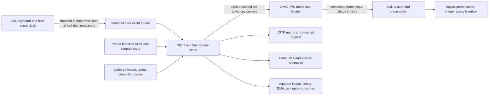

<user_constraints>
## User Constraints (from CONTEXT.md)

### Locked Decisions

### Fixture, scope, and evidence
- **D-01:** Use one small, original, project-owned, bootless 32 KiB ROM-only interactive fixture as the immediately playable demo. It must respond to controls and produce a deterministic visible outcome through a short scripted path. Include its readable source, rights notice, exact checked-in bytes, digest, build recipe, DMG-CPU-B/bootless applicability, and pass protocol. Reuse the already pinned RGBDS 1.0.1 fixture-generation path where practical; do not add an assembler dependency just for this fixture.
- **D-02:** Keep the playable demo separate from the hardware-behavior test oracles. Test frame composition with authored expected images; test raster/mode/STAT/fetch behavior with focused timing cases; test OAM DMA, VRAM/OAM restrictions, and CPU/PPU/DMA contention with separate model-applicable cases; and test joypad-driven gameplay through deterministic scripted inputs. A demo pass or plausible screenshot alone does not establish timing correctness.
- **D-03:** Prefer owned, source-reviewed tests. Add a third-party ROM only to close a named evidence gap and only after its immutable source, redistribution rights, digest, model/boot applicability, and protocol are documented. Keep unknown or inapplicable tests out of the eligible denominator. Preserve the Phase 2 lesson that exact fixture bytes and source identity do not by themselves prove fixture applicability.

### PPU, DMA, and public output
- **D-04:** Advance the PPU on the emulated dot timeline. Model the declared DMG background, window, sprites, LCD/STAT transitions, variable fetch behavior, VRAM/OAM access restrictions, and OAM DMA contention from model-qualified evidence. Keep image-composition assertions separate from dot-sensitive timing and access assertions. Pan Docs describes mode-3 duration varying with scrolling, windows, and objects; line-at-once output is not sufficient timing evidence.
- **D-05:** Expose completed video frames as a bounded copy into caller-owned storage: 160×144 pixels, explicit pitch and documented 2-bit DMG shade-index values. Keep SDL, host RGB conversion, and presentation policy in the adapter. Internal PPU progression remains dot-based; copying a completed frame is an output boundary, not a frame-at-a-time execution shortcut.
- **D-06:** Qualify every PPU/DMA assertion to the declared DMG-CPU-B profile and its sources. Use focused controls for composition, timing, and contention so a single passing fixture cannot mask an inapplicable oracle or an inaccurate timing path. Do not claim physical-hardware qualification without physical-hardware evidence.

### Input and deterministic core boundary
- **D-07:** Extend the existing fixed-capacity timestamped event boundary with joypad button press and release transitions. Preserve bounded atomic admission, stable caller ordering for equal timestamps, explicit queue-full behavior, and deterministic behavior across run partitions. The core owns active-low JOYP row selection and interrupt behavior; both the public API tests and SDL adapter must exercise this same boundary.
- **D-08:** Before encoding the exact JOYP interrupt edge/selection interaction, planning/research must record the primary model-applicable source and focused expected cases. Do not infer the electrical edge solely from SDL behavior or from a game fixture. The host adapter translates SDL scancodes and monotonic event timestamps to the emulated half-dot timeline; host clock access remains outside the core.
- **D-09:** Ignore host key-repeat events. On focus loss, pause and enqueue releases for held buttons so the guest cannot retain stuck input. Reset clears pending input/video generation state according to a documented API rule; same-timestamp ordering, event overflow, and reset behavior receive direct tests.

### Player UX, dependencies, and delivery
- **D-10:** Keep the macOS player optional and keep the portable C17 core, public API, and ordinary headless tests SDL-free. SDL3 is the one justified player dependency. Use built-in SDL rendering/dialog facilities and a small project-owned control/status treatment if text is needed; do not add SDL_ttf, ImGui, a Swift/AppKit wrapper, a generic UI framework, or network-fetched build dependencies in this phase.
- **D-11:** Start the preview with the original demo ready to play and provide a discoverable Open ROM action. Use standard macOS Open/Quit shortcuts (Command-O/Command-Q), map arrows to the D-pad, Z/X to A/B, Return to Start, and Right Shift to Select; provide clear Pause and Reset actions and show the key map in the player. Preserve the active session after a failed ROM replacement and show an actionable error. Always validate the selected file through the existing bounded loader; dialog filters are only hints.
- **D-12:** Preserve the DMG image's 10:9 aspect ratio with nearest-neighbor integer scaling and letterboxing. Set an initial/minimum window size that avoids shrinking below native size, and calculate presentation using drawable pixels on high-DPI displays. Use SDL3 logical presentation with integer scaling when supported by the pinned SDL version; do not stretch, crop, or use fractional scaling to fill the window.
- **D-13:** Make the preview visibly state that audio and battery persistence are not implemented. Keep controls, pause/focus state, and current ROM status legible without adding a general-purpose UI dependency. Treat accessibility and keyboard discoverability as product behavior, not only README documentation.
- **D-14:** Add an opt-in macOS player build and exact-revision package/build smoke to CI using an explicit SDL3 version. The ordinary core build stays offline and SDL-free. If a run-scoped preview artifact is produced, bind it to the source revision, include SDL license notices and digests, and qualify the downloaded package bytes. It is a preview artifact, not a signed/notarized public release; make no signing, notarization, or hardware claim without corresponding evidence.

### the agent's Discretion
- Choose internal PPU/DMA data structures, test decomposition, and the smallest implementation organization that preserves portable C17, explicit instance ownership, bounded public operations, deterministic time, and the decisions above.
- Choose concrete owned fixture mechanics and artwork so long as they remain original, small, reproducible, interactive, and suitable for composition and scripted gameplay evidence.
- Select the exact SDL3 patch release, CMake discovery details, artifact retention, and UI drawing approach during research/planning, subject to D-10 and D-14.
- Add a focused upstream oracle only under D-03; no upstream case is presumed eligible by name alone.

### Deferred Ideas (OUT OF SCOPE)

- CGB execution, boot-ROM support, broader cartridge mappers, and hardware-family claims remain outside the limited DMG phase.
- Audio and battery persistence belong to later phases; the visible preview must label their absence.
- Physical controllers and broader focus/device lifecycle policy belong to the later host-input phase; this phase covers the SDL keyboard path and stuck-key prevention on focus loss.
- Signed/notarized public distribution, stable release support floors, and consumer/release certification remain Phase 6.
- Third-party ROM suites remain deferred unless a specific gap and complete rights/applicability review justify adding one.
</user_constraints>

<phase_requirements>
## Phase Requirements

| ID | Description | Research Support |
|----|-------------|-----------------|
| VIDEO-01 | The declared DMG profile renders background, window, and sprites with LCD/STAT transitions and a dot-sensitive fetch design demonstrated by separate composition and timing cases. | Pan Docs rendering/FIFO details support a dot-stepped fetcher and isolated raster cases; image fixtures should verify composition independently. |
| VIDEO-02 | OAM DMA, VRAM/OAM access restrictions, and CPU/PPU/DMA contention produce expected model-specific observable results. | Pan Docs documents access windows and 160 M-cycle DMG DMA duration; its board-revision qualification means tests must state what DMG-CPU-B evidence does and does not establish. |
| VIDEO-03 | Timestamped joypad transitions affect the guest deterministically, including selection/interrupt behavior; the public API and SDL keyboard path exercise the same input boundary. | Pan Docs defines active-low matrix/read selection; finer interrupt sampling behavior remains an explicit source gap and needs focused cases before locking expected edges. |
| VIDEO-04 | A macOS user can launch the optional player, open a supported ROM-only image, play an original or explicitly permissioned interactive GB fixture, resize with correct aspect/integer scaling, pause, reset, and quit with actionable errors. | SDL3 3.4.18 official release and SDL CMake, keyboard, dialog, high-DPI, and logical-presentation documentation provide current adapter/build details. |
| VIDEO-05 | Automated checks distinguish image composition, raster timing, and scripted gameplay outcomes, and the visible preview clearly identifies still-incomplete audio/persistence support. | Split expected-image, focused timing/contention, and scripted guest tests; run exact-revision optional macOS build/package smoke and bind any artifact to its source digest. |
</phase_requirements>

## Project Constraints (from AGENTS.md)

- GabbaBoy targets Game Boy and Game Boy Color; copied NES/Neo Geo/Elixir examples are background only. Do not claim an unimplemented emulator works.
- Preserve the original portable C core, explicit ownership/error behavior, bounded public operations, and no hidden globals. Host timing, filesystem, UI, audio devices, and environment configuration stay in adapters.
- Prefer small direct code and targeted abstractions. Explain hardware reasons and subtle invariants.
- Guard ROM/save/state boundaries against overflow, truncation, excess allocation/work, and partial mutation; use explicit portable serialization instead of raw C structure dumps.
- Distinguish hardware-backed tests, differential oracle results, metamorphic properties, regression fixtures, and private game observations. Declare model applicability, exclusions, and expected-failure reasons.
- Do not add Nintendo boot ROMs, commercial game images, unlicensed homebrew, private data, or mandatory telemetry. Document redistribution rights and digest for every third-party fixture.
- Keep ordinary core builds/tests SDL-free and offline. Use ignored `.env.local` for local secrets; never publish personal paths, emails, machine identifiers, or secret values.
- Stop at this phase handoff; do not auto-advance. Keep workflow auto-advance inactive and report evidence and the next phase route to the owner.
- Automate verification. Do not invent manual UAT to satisfy a template. State hardware, perceptual, or credential limitations and the smallest necessary human action.
- Before completion, inspect current verification evidence and requirement traceability; documents or plausible screenshots alone do not complete a phase.

## Summary

**Primary recommendation:** Extend the existing half-dot/event core in place with an instance-owned dot-stepped PPU, bounded completed-frame copy, and button transitions; keep SDL3 3.4.18 in a separate optional macOS target using the imported CMake target. Use authored images for composition, source-qualified focused cases for mode/fetch/DMA timing, and a scripted original ROM for deterministic gameplay. [CITED: https://gbdev.io/pandocs/Rendering] [CITED: https://gbdev.io/pandocs/pixel_fifo] [CITED: https://wiki.libsdl.org/SDL3/README-cmake] [CITED: https://github.com/libsdl-org/SDL/releases]

The JOYP matrix and active-low read behavior are documented, but the exact interrupt sampling/selection interaction requested by D-08 is not established by Pan Docs' JOYP chapter. Gekkio's hardware-research note reports synchronous sampling behavior, while not clearly identifying a DMG-CPU-B-specific setup. Treat that as a research lead, not a final expected-value oracle: planning should record this applicability limitation and define the direct selection/press/release cases while avoiding a stronger hardware claim than the source supports. [CITED: https://gbdev.io/pandocs/Joypad_Input] [CITED: https://gekkio.fi/blog/2017/game-boy-research-status/]

### D-08 source audit — 2026-10-07

- Nintendo's *Game Boy Programming Manual* v1.1, Chapter 1 §2.4.1 and §2.4.4 (printed pp. 24–26), is primary DMG-family documentation. It specifies the P14/P15 key matrix, two reads after selecting P14, six after P15, and a P10–P13 negative-edge interrupt that requires the line to remain low for (2^4) source-oscillator periods (16, not 24). The DMG source is listed as 4 MHz; this rounded rate does not establish a CPU-B sampling phase or how selection writes affect a held key at that phase. [CITED: https://archive.org/details/GameBoyProgManVer1.1/page/n23/mode/2up]
- The 2017 hardware note reports synchronous sampling: two low observations at specific clock edges can request the interrupt even with a high interval between them. It says the exact clock count required more research and does not identify a DMG-CPU-B trace. This is an unresolved difference from a simple continuous-low interpretation, not a safe timing oracle. [CITED: https://gekkio.fi/blog/2017/game-boy-research-status/]
- The DMG-CPU-B die-derived schematic set is pinned to verified repository commit [`28f66aedf974b91aafeb42443f2b731fcd7769e7`](https://github.com/msinger/dmg-schematics/commit/28f66aedf974b91aafeb42443f2b731fcd7769e7). Its FF00 sheet shows a `CLK_1MHz`-clocked input path to `INT_JP`; its FF0F sheet connects `INT_JP` to CPU_IRQ4/IF bit 4. This improves the circuit-path trace, but the reconstructed schematic is not an independently qualified input-to-IF timing measurement and does not bind an external input transition to the bootless half-dot origin, especially at coincident sample edges. [CITED: https://github.com/msinger/dmg-schematics/tree/28f66aedf974b91aafeb42443f2b731fcd7769e7/dmg_cpu_b]
- **Disposition:** keep active-low matrix polling and timestamped queue behavior. Do not implement a guessed IF edge or register placeholder interrupt tests. D-08 remains open and VIDEO-03 remains incomplete until an exact input/sample phase is validated for press, release, held-key switching, and before/at/after sample cases.

Execution correction: the manual's superscript (2^4) had been flattened to “24” in the research note and gap plan, and the previously cited schematic commit did not resolve in the upstream repository. The printed manual page was checked visually; the schematics were repinned to a commit whose source files were fetched and inspected. See [the evidence ledger](../../../docs/dmg-video-evidence.md#source-to-timestamp-trace).

The environment has CMake 4.4.3 and Xcode 26.6; RGBDS and SDL3 are not installed, so local fixture rebuild and player linkage are unavailable here. The repository already pins RGBDS 1.0.1 for fixture regeneration and provides checked-in bytes for offline routine tests. Physical DMG-CPU-B evidence is unavailable; conclusions must distinguish model-qualified references, owned tests, and hardware observation. [VERIFIED: fixtures/tracer/manifest.json:6-14] [VERIFIED: .planning/phases/GB-02-dmg-cpu-bus-and-time/02-VALIDATION.md]

## Architectural Responsibility Map

| Capability | Primary Tier | Secondary Tier | Rationale |
|------------|-------------|----------------|-----------|
| PPU state, register behavior, scan/fetch, frame buffer, DMA and arbitration | API / Backend | — | Hardware state and time belong to the portable per-instance core; no SDL types or host clock should enter it. [VERIFIED: src/core/gabbaboy.c] [CITED: https://gbdev.io/pandocs/Rendering] |
| Joypad matrix, selected lines and interrupt request | API / Backend | Browser / Client (SDL adapter) | Core owns device semantics; SDL only translates keyboard events into timestamped button transitions. [CITED: https://gbdev.io/pandocs/Joypad_Input] |
| Frame display, controls, file selection and status | Browser / Client | API / Backend | The optional host adapter copies the completed frame and converts it to presentation pixels; the core remains headless. [CITED: https://wiki.libsdl.org/SDL3/SDL_SetRenderLogicalPresentation] |
| ROM fixture reproducibility and rights provenance | CDN / Static | API / Backend | Static checked-in bytes, source, manifest and license are validated separately from the guest's behavior. [VERIFIED: fixtures/tracer/manifest.json:1-28] |
| Optional macOS package and downloaded artifact smoke | CDN / Static | Browser / Client | CI builds and hashes the exact target artifact; macOS consumer smoke verifies the artifact bytes rather than infer behavior from a local build. [VERIFIED: .github/workflows/preview.yml] [CITED: https://docs.github.com/en/actions/concepts/workflows-and-actions/workflow-artifacts] |

## Standard Stack

### Core

| Library / component | Version | Purpose | Why standard |
|---------------------|---------|---------|--------------|
| Existing GabbaBoy C core and public API | C17 [VERIFIED: CMakeLists.txt:21-28; `target_compile_features(gabbaboy_core PUBLIC c_std_17)`; `set_target_properties(gabbaboy_core PROPERTIES C_EXTENSIONS OFF)`] | Own the PPU, JOYP, DMA, time, and bounded video/input API | This is the existing portable product boundary; preserve instance ownership and do not add SDL to core. [VERIFIED: include/gabbaboy/gabbaboy.h:92-114; `The opaque instance owns its mutable state and a private copy of a loaded ROM.`; `Copies events into a fixed 64-event per-instance queue.`] |
| SDL3 | 3.4.18, current official release observed 2026-10-07 | Optional macOS keyboard/window/render/file-dialog adapter | SDL 3.2.0 introduced the needed logical-presentation, keyboard, and dialog APIs; 3.4.18 is the latest stable upstream release observed and contains those APIs. Its release notes also include a macOS fix for windows lingering after `SDL_Quit()`, directly relevant to the target player. Pin this exact patch in opt-in CI, then verify its source archive digest. [CITED: https://github.com/libsdl-org/SDL/releases/tag/release-3.4.18] [CITED: https://wiki.libsdl.org/SDL3/SDL_SetRenderLogicalPresentation] [CITED: https://wiki.libsdl.org/SDL3/SDL_KeyboardEvent] [CITED: https://wiki.libsdl.org/SDL3/SDL_ShowOpenFileDialog] |
| RGBDS | 1.0.1 | Reproduce the owned interactive fixture | Reuse the project's already locked assembler path; ordinary tests consume bytes and remain offline. [VERIFIED: fixtures/tracer/manifest.json:6-14; `"assembler": "RGBDS"`; `"version": "1.0.1"`; `"archive_sha256": "2f6f13c6ec984313656c07b08d97dfcd3a471c7d3901d3ff486e5814bb503645"`] |

### Supporting

| Library / component | Version | Purpose | When to use |
|---------------------|---------|---------|-------------|
| CMake `find_package(SDL3 CONFIG)` and `SDL3::SDL3` | SDL3 config package | Gate optional player target and link SDL without exposing it through installed core | Use when the player option is enabled; SDL upstream documents `SDL3::SDL3` as the guaranteed target. [CITED: https://wiki.libsdl.org/SDL3/README-cmake] |
| CTest plus project's expected-test inventory | Existing configured version | Register named deterministic image, timing, contention, input, fixture and adapter cases | Follow current fail-closed inventory rather than allow zero-selected tests to pass silently. [VERIFIED: tests/CMakeLists.txt] [VERIFIED: tests/expected-tests.txt] |

### Alternatives Considered

| Instead of | Could Use | Tradeoff |
|------------|-----------|----------|
| SDL3 logical presentation and built-in renderer/dialog | AppKit wrapper or a third-party UI/text dependency | Those add an independent host framework or package contrary to locked scope; SDL3 already provides the required window, keyboard, rendering, and file dialog surfaces. [CITED: https://wiki.libsdl.org/SDL3/README-cmake] |
| Original owned ROM fixture | Third-party PPU/game ROM | Third-party bytes add rights/applicability review and do not automatically prove DMG-CPU-B coverage; add only for a named uncovered case. [VERIFIED: .planning/phases/GB-02-dmg-cpu-bus-and-time/02-VALIDATION.md] |
| Dot-stepped fetcher | Scanline-at-once composition | Scanline composition cannot itself establish variable mode-3/fetch timing or CPU access contention. [CITED: https://gbdev.io/pandocs/pixel_fifo] |

**Installation / discovery:** Keep the routine core build unchanged and offline. When enabled, use an explicit SDL3 package source/version and `find_package(SDL3 CONFIG REQUIRED)`; do not use an unpinned `FetchContent` network fetch. The official upstream CMake integration documents shared/static config targets and macOS framework builds. [CITED: https://wiki.libsdl.org/SDL3/README-cmake]

**Version verification:** SDL3 3.4.18 was the latest stable upstream release observed on 2026-10-07, published 2026-10-02. The official release lists the source archive SHA-256 `9c75cf16330322c217dedd2e0609f1124f1b54b8633e763467b4684d0f4334a3`. This patch also fixes macOS windows lingering after `SDL_Quit()`, so it supersedes the earlier 3.4.16 recommendation for this macOS player. RGBDS 1.0.1 is the already pinned local fixture tool, but it is not installed in this environment. [CITED: https://github.com/libsdl-org/SDL/releases/tag/release-3.4.18] [VERIFIED: fixtures/tracer/manifest.json:7-11; `"version": "1.0.1"`; `"archive": "rgbds-macos.zip"`; `"archive_sha256": "2f6f13c6ec984313656c07b08d97dfcd3a471c7d3901d3ff486e5814bb503645"`]

## Package Legitimacy Audit

SDL3 is a native upstream C library acquired as an explicitly pinned upstream release/source package, not a package from npm, PyPI, or crates.io; the language-specific package-legitimacy seam does not apply to this dependency. Prefer the official release asset and its published digest; do not substitute a similarly named registry package. The current release page provides the exact version and source archive digest. [CITED: https://github.com/libsdl-org/SDL/releases]

| Package | Registry | Age | Downloads | Source Repo | Verdict | Disposition |
|---------|----------|-----|-----------|-------------|---------|-------------|
| SDL3 3.4.18 | Official upstream source archive | Published 2026-10-02 | Not reported in consulted source | github.com/libsdl-org/SDL | Official source, SHA-256 `9c75cf16330322c217dedd2e0609f1124f1b54b8633e763467b4684d0f4334a3` | Use only for opt-in player build; verify archive bytes and include license notice |
| RGBDS 1.0.1 | Official upstream release archive | Already pinned in project | Not reported in consulted source | github.com/gbdev/rgbds | Existing fixture tool | Reuse existing verified pin; no new dependency |

**Packages removed due to SLOP verdict:** none; no registry package candidates were proposed.
**Packages flagged as suspicious SUS:** none.

## Architecture Patterns

### System Architecture Diagram



### Recommended Project Structure

Keep the portable device implementation in the existing core and keep the host adapter/build separate. Add focused sources only if the current core becomes difficult to reason about:

```text
src/
├── core/                 # instance-owned PPU, JOYP, DMA and bus timing
├── player/               # optional SDL3 adapter; host clock, file dialog, rendering
└── runner/               # headless execution and deterministic evidence receipts
tests/
├── test_ppu.c            # expected image and mode/fetch cases, reported separately
├── test_dma.c            # transfer timing, access restrictions and contention
└── test_joypad.c         # public queue, JOYP selection, IF and partition checks
fixtures/
└── visible-demo/         # owned source, bytes, license, manifest, digest and recipe
```

### Pattern 1: JOYP sampled read and interrupt cases

**What:** Store physical button state per instance; derive the low-nibble JOYP value from the selected active-low row(s) at a CPU-visible read. Treat row selection writes and button transitions as possible causes of a visible line transition. The interrupt sampling algorithm is the one unresolved research decision: Pan Docs establishes the matrix and read polarity, while the Gekkio article describes clock-synchronous interrupt observations without a clear DMG-CPU-B qualification. Do not silently replace this qualification gap with a simple `old_low & ~new_low` rule. [CITED: https://gbdev.io/pandocs/Joypad_Input] [CITED: https://gekkio.fi/blog/2017/game-boy-research-status/]

**When to use:** For every JOYP CPU read/write, timestamped press/release, and IF request; keep the same transition API for direct public-core calls and SDL input.

**Focused cases to plan:** both rows unselected; each row selected alone; both rows selected and shared low bits; press/release while selected versus unselected; writing selection while a button is already held; switching rows while held; duplicate press/release; equal-timestamp opposite transitions in caller order; queue-full atomicity; run partition equivalence; reset with pending and held inputs. For interrupt edge expectations, cite the applicable primary source and keep unsupported sub-cycle cases outside the qualified denominator.

### Pattern 2: Dot-driven PPU and bounded frame output

**What:** Advance PPU mode/fetch state on the emulated dot schedule (existing core time is represented in half-dots); produce visible pixels incrementally into an instance-owned shade-index buffer; make the public completed-frame operation a size/pitch-checked bounded copy. Derive CPU access denial from the current PPU/DMA owner at the actual bus-access time. Separate frame pixel output from emulated frame progression. [VERIFIED: include/gabbaboy/gabbaboy.h:51-55; `uint64_t at_half_dots;`] [CITED: https://gbdev.io/pandocs/Rendering] [CITED: https://gbdev.io/pandocs/pixel_fifo] [CITED: https://gbdev.io/pandocs/Accessing_VRAM_and_OAM]

**When to use:** Composition tests compare a fixed completed buffer; mode timing tests inspect LY/STAT transitions and first/last visible pixels; access tests read/write VRAM/OAM around the locked intervals. Include scrolling low bits, window start, object count/positions and LCD disable/enable as separate cases because these can alter mode-3 behavior. Pan Docs itself marks some penalty ordering as needing more research, so avoid asserting that behavior as hardware-known without an independent source. [CITED: https://gbdev.io/pandocs/pixel_fifo]

### Pattern 3: Optional SDL3 adapter and player smoke

**What:** Gate the executable behind a CMake option; `find_package(SDL3 CONFIG REQUIRED)` only in that branch and link `SDL3::SDL3` privately. Map physical scancodes and key down/up events to core buttons; discard events with SDL's repeat flag. SDL keyboard event timestamps are SDL tick-clock nanoseconds, so translate using a host clock anchor and explicit integer conversion to core half-dots outside the core. SDL file dialogs return asynchronously and callbacks may run on another thread: copy the selected UTF-8 path into owned adapter storage or dispatch to the UI thread before invoking the existing bounded loader. Only replace the active ROM/session after load succeeds. [CITED: https://wiki.libsdl.org/SDL3/README-cmake] [CITED: https://wiki.libsdl.org/SDL3/SDL_KeyboardEvent] [CITED: https://wiki.libsdl.org/SDL3/SDL_ShowOpenFileDialog] [VERIFIED: include/gabbaboy/gabbaboy.h:101-104; `A failed replacement leaves the current ROM and machine state unchanged.`]

Use `SDL_SetRenderLogicalPresentation(renderer, 160, 144, SDL_LOGICAL_PRESENTATION_INTEGER_SCALE)` if the selected SDL version supports that mode; SDL documents the function since 3.2.0. Set texture scale mode to nearest, reserve the display's non-10:9 remainder for letterboxing, and use drawable pixel size on high-DPI changes. Integer scaling may leave larger bars; this is intended. [CITED: https://wiki.libsdl.org/SDL3/SDL_SetRenderLogicalPresentation] [CITED: https://wiki.libsdl.org/SDL3/README-highdpi]

### Pattern 4: Reproducible original fixture

**What:** Keep source, rights notice, exact binary, SHA-256, profile and boot applicability, expected game protocol, and assembler/build recipe beside each other in a manifest. Add reproduction as a separate explicit CI job using the project's existing RGBDS pin; ordinary tests verify checked-in bytes and remain network independent. A successful source rebuild proves byte identity, not behavior or hardware applicability. [VERIFIED: fixtures/tracer/manifest.json:1-27] [VERIFIED: fixtures/tracer/LICENSE.txt:1-3] [VERIFIED: .github/workflows/fixture-repro.yml]

### Anti-Patterns to Avoid

- **Frame-at-a-time PPU step:** cannot model CPU-visible STAT/mode changes or access contention during a scanline. [CITED: https://gbdev.io/pandocs/Rendering]
- **One ROM/screenshot as all PPU evidence:** composition, raster timing, DMA conflicts, and gameplay are different claims and need independent oracles. [CITED: https://gbdev.io/pandocs/Rendering] [VERIFIED: .planning/phases/GB-02-dmg-cpu-bus-and-time/02-VALIDATION.md]
- **Assuming one ordinary falling-edge JOYP implementation is proven for DMG-CPU-B:** the referenced hardware-research note suggests synchronous sampling, and Pan Docs does not provide the requested fine edge detail. Mark exact behavior unresolved until primary model-applicable evidence is established. [CITED: https://gekkio.fi/blog/2017/game-boy-research-status/] [CITED: https://gbdev.io/pandocs/Joypad_Input]
- **Doing file I/O or host-clock reads in callbacks while mutating the live machine:** SDL dialog callback threading is platform-dependent; transfer copied results to controlled adapter state and preserve transactional ROM replacement. [CITED: https://wiki.libsdl.org/SDL3/SDL_DialogFileCallback] [VERIFIED: include/gabbaboy/gabbaboy.h:101-104; `A failed replacement leaves the current ROM and machine state unchanged.`]
- **Enabling SDL through default core discovery or an unpinned online fetch:** it would violate the headless/offline boundary and make ordinary builds depend on network state. [VERIFIED: CMakeLists.txt:21-33; `add_library(gabbaboy_core STATIC src/core/gabbaboy.c)`; `target_compile_features(gabbaboy_core PUBLIC c_std_17)`] [CITED: https://wiki.libsdl.org/SDL3/README-cmake]

## Don't Hand-Roll

| Problem | Don't Build | Use Instead | Why |
|---------|------------|-------------|-----|
| macOS file chooser | A custom filesystem browser | SDL3 native file dialog | SDL already exposes native open dialog and filter APIs; handle async completion and validate via the core loader regardless of dialog filtering. [CITED: https://wiki.libsdl.org/SDL3/SDL_ShowOpenFileDialog] |
| Pixel scaling and letterbox math | A pile of host point-size assumptions | SDL logical presentation plus its high-DPI drawable sizing | SDL exposes logical resolution/integer-scale and separate window/drawable dimensions for high-density displays. [CITED: https://wiki.libsdl.org/SDL3/SDL_SetRenderLogicalPresentation] [CITED: https://wiki.libsdl.org/SDL3/README-highdpi] |
| External core timing and host input | A new scheduler or parallel input queue | Existing half-dot clock and fixed-capacity ordered queue | Existing API already owns timestamp validation and stable equal-time ordering; extend its contracts rather than creating a second path. [VERIFIED: include/gabbaboy/gabbaboy.h:105-115; `Timestamps are absolute half-dot ticks and must be nondecreasing within the batch`; `Equal timestamps keep caller order.`] |
| Fixture provenance | A binary-only demo | Original assembly, license, manifest, digest and build recipe | Reproducibility and ownership remain independently reviewable. [VERIFIED: fixtures/tracer/manifest.json:1-14] |

**Key insight:** The phase is an integration of guest-visible state and evidence boundaries. The PPU's internal dot progression is the semantic engine; the image copy and SDL display are consumers. Tests must preserve those distinctions so a correct-looking display cannot hide wrong timing.

## Common Pitfalls

### Pitfall 1: Confusing pixels with timing

**What goes wrong:** A rendered frame looks correct while mode 3 length, STAT timing, or VRAM/OAM locks are wrong.
**Why it happens:** A completed image discards the time and arbitration history that produced it. Pan Docs documents mode-3 variable fetch work for windows and objects. [CITED: https://gbdev.io/pandocs/pixel_fifo]
**How to avoid:** Build separate expected-image, LY/STAT/fetch-duration, and CPU access tests; retain timing receipts and source applicability with each.
**Warning signs:** A screenshot or demo pass is used to justify mode timing or contention.

### Pitfall 2: Applying DMA rules without model qualification

**What goes wrong:** One generic bus lock produces misleading claims across DMG/CGB or timing cases.
**Why it happens:** DMA CPU access depends on model/bus topology; Pan Docs states DMG can access only HRAM during OAM DMA and describes model/revision-specific PPU effects. [CITED: https://gbdev.io/pandocs/OAM_DMA_Transfer]
**How to avoid:** Scope Phase 3 checks to DMG-CPU-B, separate CPU-bus restrictions from PPU OAM corruption/fetch effects, and identify unqualified revision observations explicitly.
**Warning signs:** CGB exceptions, generic "all Game Boy" claims, or a DMA test passing without asserting exact bus initiator and timing.

### Pitfall 3: Treating SDL event time as emulated time

**What goes wrong:** The core becomes nondeterministic or partition-dependent because host clock reads happen during emulated execution.
**Why it happens:** SDL timestamps are host ticks in nanoseconds, while core events use absolute half-dot ticks. [CITED: https://wiki.libsdl.org/SDL3/SDL_KeyboardEvent] [VERIFIED: include/gabbaboy/gabbaboy.h:51-55; `uint64_t at_half_dots;`]
**How to avoid:** Keep clock anchoring and conversion in the adapter; queue explicit integer timestamps; test the public queue independently of SDL and compare run partitions.
**Warning signs:** A core API that reads wall time or one direct SDL path that bypasses queue validation.

### Pitfall 4: File-dialog callback lifetime/thread assumptions

**What goes wrong:** The player reads a stale path or mutates emulator state on an unexpected thread.
**Why it happens:** SDL documents asynchronous dialogs and a callback that may run on a different thread. [CITED: https://wiki.libsdl.org/SDL3/SDL_DialogFileCallback]
**How to avoid:** Copy callback data into owned memory, dispatch UI/core changes through the player event loop, and only commit a new session after bounded load success.
**Warning signs:** Retaining `filelist` pointers after callback return or replacing the current ROM before validation.

### Pitfall 5: Letting the fixture define its own success

**What goes wrong:** A ROM reports success even though its expected video/game behavior is wrong or the CPU lacks needed semantics.
**Why it happens:** Source identity, binary digest and self-reported pass protocol establish different properties; Phase 2 explicitly records fixture applicability limits. [VERIFIED: fixtures/tracer/manifest.json:15-27] [VERIFIED: .planning/phases/GB-02-dmg-cpu-bus-and-time/02-VALIDATION.md]
**How to avoid:** Keep fixed expected images and independently scripted host input/outcome assertions; record reachable instruction subset and profile separately from claims.
**Warning signs:** Fixture pass flag is the only composition, timing, or hardware oracle.

## Code Examples

### SDL3 optional target pattern

```cmake
option(GABBABOY_BUILD_PLAYER "Build optional SDL3 player" OFF)
if(GABBABOY_BUILD_PLAYER)
  find_package(SDL3 3.4.18 EXACT CONFIG REQUIRED)
  add_executable(gabbaboy-player src/player/main.c)
  target_link_libraries(gabbaboy-player PRIVATE GabbaBoy::core SDL3::SDL3)
endif()
```

Source: SDL3's CMake guide guarantees `SDL3::SDL3`; this version floor/EXACT form is the phase recommendation and should be confirmed against the project's CMake policy during planning. [CITED: https://wiki.libsdl.org/SDL3/README-cmake]

### Integer logical presentation

```c
if (!SDL_SetRenderLogicalPresentation(renderer, 160, 144,
                                     SDL_LOGICAL_PRESENTATION_INTEGER_SCALE)) {
    report_player_error(SDL_GetError());
}
```

Source: SDL3 API reference. Keep shade-to-RGB palette conversion in the adapter and upload only a completed copied frame. [CITED: https://wiki.libsdl.org/SDL3/SDL_SetRenderLogicalPresentation]

### Existing timestamp boundary to extend

The current source defines the exact current event values and structure as follows; future joypad kinds must be added deliberately and tested, rather than assuming these enum values already exist: [VERIFIED: include/gabbaboy/gabbaboy.h:46-55]

```c
typedef enum {
    GBB_INPUT_STOP_WAKE = 1,
    GBB_INPUT_SERIAL_EDGE
} gbb_input_event_kind;

typedef struct {
    uint64_t at_half_dots;
    gbb_input_event_kind kind;
    uint8_t value;
} gbb_input_event;
```

The API documents fixed capacity, absolute timestamps, stable equal-time order, and atomic admission; keep those guarantees as the new button events share this queue. [VERIFIED: include/gabbaboy/gabbaboy.h:105-115; `Copies events into a fixed 64-event per-instance queue.`; `Equal timestamps keep caller order.`; `Admission is atomic: invalid batches and batches exceeding remaining capacity append nothing.`]

## State of the Art

| Earlier shortcut | Current supported approach | Evidence / impact |
|------------------|----------------------------|-------------------|
| Produce a complete scanline/frame without interleaved device progression | Dot-stepped pixel fetch and output, with mode transitions observable during guest execution | Pan Docs describes fetcher FIFO stalls and mode-3 extensions for sprites/window; this justifies the architecture, but not every edge as physically confirmed. [CITED: https://gbdev.io/pandocs/pixel_fifo] |
| SDL2-era logical-size/integer-scale setters | SDL3 `SDL_SetRenderLogicalPresentation` with explicit logical scale mode | SDL's migration guide identifies the replacement API, and current docs say it is available since SDL 3.2.0. [CITED: https://wiki.libsdl.org/SDL3/README-migration] [CITED: https://wiki.libsdl.org/SDL3/SDL_SetRenderLogicalPresentation] |
| Assume window coordinates equal rendered pixels | Query drawable pixel size and react to pixel-size changes on high-density displays | SDL3 distinguishes window coordinate size and pixel size, including on macOS. [CITED: https://wiki.libsdl.org/SDL3/README-highdpi] |

**Deprecated/outdated:** SDL2 `SDL_RenderSetIntegerScale` was removed in SDL3; use `SDL_SetRenderLogicalPresentation` with integer scaling. [CITED: https://wiki.libsdl.org/SDL3/README-migration]

## Assumptions Log

| # | Claim | Section | Risk if Wrong |
|---|-------|---------|---------------|
| A1 | The Gekkio 2017 JOYP interrupt observation is contextual only and does not establish DMG-CPU-B expected behavior. | Summary / Pattern 1 | Treating an unpinned observation as this profile's hardware truth could encode the wrong edge model. |
| A2 | SDL3 3.4.18 package config is usable with the repository's CMake 3.25 floor and target macOS runner without additional project dependency changes. | Standard Stack | Configuration/linkage can fail or need an explicit runner/toolchain arrangement. |
| A3 | The macOS player can use SDL's built-in file dialog and built-in renderer for both display and legible status/help treatment without a separate text package. | Pattern 3 | If custom text rendering is inadequate, product accessibility/discoverability requires another project-owned implementation decision. |
| A4 | An owned ROM can exercise all target composition assertions and a short deterministic gameplay sequence within the current declared CPU instruction scope. | Fixture / validation map | The fixture may require CPU functionality outside the existing emulator; scope/fixture mechanics would need adjustment. |
| A5 | No physical DMG-CPU-B observation can be obtained in the current environment. | Summary / limitations | This environment has no physical hardware evidence; a later owner may add such evidence from a real device. |

## Planning Decisions and Execution Gates

The open questions below were converted into explicit plan gates. Their outcomes do not manufacture hardware evidence or claim that implementation has already passed.

| Topic | Planning resolution | Execution gate |
|-------|---------------------|----------------|
| DMG-CPU-B JOYP interrupt sampling | **Unresolved hardware fact.** Pan Docs establishes active-low matrix selection; the available Gekkio observation is not pinned to DMG-CPU-B and is context only. No exact edge behavior is selected. | Before encoding JOYP IF edge/selection behavior, plan 03-04 must record a primary, model-applicable source and focused cases. If none is found, leave the IRQ behavior and VIDEO-03 completion blocked; do not substitute SDL behavior, a fixture, or another emulator. |
| Dot-sensitive PPU edge scope | Implement the locked BG/window/object, LCD/STAT/fetch and DMA requirements using per-case source/model records. Treat uncertain sprite/window/FIFO and arbitration edges as explicit exclusions from claims until applicable evidence exists. | Plans 03-02 and 03-03 require the source matrix before exact timing/contention assertions; an unsupported edge cannot count as an eligible passing case or silently narrow VIDEO-01/02. |
| SDL acquisition and artifact form | Use the optional SDL3 3.4.18 CMake package from an official immutable release source, checking its published digest before any opt-in provisioning. Package only a run-scoped preview bound to the tested revision with SDL notices and digests. | Plans 03-05/03-09 keep provisioning outside default configure, run the smoke from downloaded bytes, and make no signing/notarization claim. If a trusted immutable checksum or exact-head macOS runner is unavailable, the corresponding check remains pending. |

## Environment Availability

| Dependency | Required By | Available | Version | Fallback |
|------------|------------|-----------|---------|----------|
| CMake | Build and optional target | ✓ | 4.4.3 [VERIFIED: `cmake --version`] | — |
| Xcode command-line tools | macOS player compile/link | ✓ | Xcode 26.6 / build 17F113 [VERIFIED: `xcodebuild -version`] | — |
| SDL3 development package | Optional player compile/link | ✗ | — [VERIFIED: `pkg-config --exists sdl3`; `command -v sdl3-config`] | Existing core and headless tests remain SDL-free; install/use the pinned SDL3 source/config in opt-in CI |
| RGBDS | Rebuild the original fixture | ✗ | — [VERIFIED: `command -v rgbasm`; `command -v rgblink`; `command -v rgbfix`] | Routine checks use checked-in fixture bytes; pinned fixture-reproduction workflow installs its release archive |
| `pkg-config` | Optional SDL discovery | ✗ | — [VERIFIED: `command -v pkg-config`] | Use SDL3's CMake config package, the upstream documented path |

**Missing dependencies with no fallback:** none for core work; SDL3 is a hard requirement only for the optional player lane and must be provisioned there.

**Missing dependencies with fallback:** SDL3 and RGBDS are absent locally; SDL3 is only required in the optional player workflow and fixture regeneration remains a dedicated explicit action using checked-in bytes in ordinary tests.

## Validation Architecture

### Test Framework

| Property | Value |
|----------|-------|
| Framework | CTest with native C test executables and fail-closed expected-test inventory |
| Config file | `tests/CMakeLists.txt`, `cmake/ExpectedTests.cmake`, `tests/expected-tests.txt` |
| Quick run command | `cmake --preset phase1 && cmake --build --preset phase1 && ctest --preset phase1 --output-on-failure --no-tests=error -R '^(joypad_|ppu_|dma_|frame_)'` |
| Full suite command | `cmake --preset phase1 && cmake --build --preset phase1 && ctest --preset phase1 --output-on-failure --no-tests=error` |

### Phase Requirements → Test Map

| Req ID | Behavior | Test Type | Automated Command | File Exists? |
|--------|----------|-----------|-------------------|-------------|
| VIDEO-01 | Fixed expected DMG shade-index images for BG/window/OBJ composition, with independent mode/LY/STAT/fetch timing probes | unit / regression | `ctest --preset phase1 --output-on-failure --no-tests=error -R '^(frame_composition_|ppu_timing_)'` | No — Phase 3 Wave 0 |
| VIDEO-02 | DMA transfer progress, HRAM-only access policy, VRAM/OAM mode restrictions, and accesses competing at named bus times | unit / regression | `ctest --preset phase1 --output-on-failure --no-tests=error -R '^dma_'` | No — Phase 3 Wave 0 |
| VIDEO-03 | Direct public event queue and guest JOYP/IF behavior; adapter key repeat/focus behavior; same input receipt produces equal output across run partitions | unit / integration | `ctest --preset phase1 --output-on-failure --no-tests=error -R '^joypad_'` | No — Phase 3 Wave 0 |
| VIDEO-04 | Optional macOS build, launch/session load smoke, safe failure replacing ROM, exact artifact digest and extracted-package smoke | integration / package smoke | `ctest --preset phase1 --output-on-failure --no-tests=error -R '^(player_|preview_package_smoke$)'` | No — Phase 3 Wave 0 and opt-in hosted macOS lane |
| VIDEO-05 | Independent image, timing, contention and scripted game result reports; visible text for absent audio and persistence | unit / integration / static UI assertions | `ctest --preset phase1 --output-on-failure --no-tests=error -R '^(frame_|ppu_timing_|dma_|joypad_gameplay_|player_status_)'` | No — Phase 3 Wave 0 |

### Sampling Rate

- **Per task commit:** Run the named focused CTest selection after building with the core preset.
- **Per wave merge:** Full offline core suite and strict expected-test inventory; optional player CI job on the change's exact revision.
- **Phase gate:** Exact-head core and macOS player checks green; fixture reproduction/digest verified; artifact consumer smoke checks downloaded bytes when an artifact exists. Hosted results must match the reviewed revision.

### Wave 0 Gaps

- [ ] Add and register image composition cases with stable expected shade-index data and pitch/capacity canaries.
- [ ] Add mode transition, LY/STAT, variable fetch and LCD enable/disable timing cases with source and model applicability.
- [ ] Add OAM DMA progress, HRAM restriction, PPU lock, and CPU/PPU/DMA contention cases; explicitly qualify any DMA sprite effects whose revision applicability is weak.
- [ ] Add public JOYP queue and matrix/interrupt cases, after the exact interrupt-edge decision is source-qualified; include ordering, overflow, reset, partition and held-button row-selection controls.
- [ ] Add the project-owned interactive fixture source, rights notice, manifest, exact bytes, digest, reproducibility script and test protocol.
- [ ] Add an optional SDL3 target and adapter smoke without changing the headless target dependency graph.
- [ ] Add a pinned SDL3 exact-revision macOS build/package smoke and artifact digest/license metadata.
- [ ] Extend installed-package/core consumer checks and the fail-closed test inventory for all newly registered tests.

## Security Domain

### Applicable ASVS Categories

| ASVS Category | Applies | Standard Control |
|---------------|---------|-----------------|
| V2 Authentication | No | No login or identity surface in this phase. |
| V3 Session Management | No | No authenticated application session; in-game pause/input lifecycle is local adapter state. |
| V4 Access Control | Yes | Treat ROM file selection as untrusted input; expose only the existing bounded loader and preserve current instance on failure. |
| V5 Input Validation | Yes | Validate file size/header/type through bounded loader; validate event kind, timestamps, queue capacity and frame pitch/capacity before mutation. |
| V6 Cryptography | Yes | Use SHA-256 to pin fixture and artifact bytes; do not invent a cryptographic protocol. |

### Known Threat Patterns for C17 / SDL3

| Pattern | STRIDE | Standard Mitigation |
|---------|--------|---------------------|
| Truncated, oversized or malformed ROM selected through dialog | Tampering / DoS | Existing loader validation, bounded read/allocation, transactional replacement and explicit user-facing error. [VERIFIED: include/gabbaboy/gabbaboy.h:101-104; `A failed replacement leaves the current ROM and machine state unchanged.`] |
| Oversized pitch/undersized output buffer or arithmetic overflow in frame copy | Tampering / DoS | Checked multiplication/addition; validate output length/pitch before writing; leave caller storage untouched on rejected operation. [ASSUMED] |
| Callback path lifetime or cross-thread state mutation | Tampering / DoS | Copy callback-owned path bytes before return and dispatch loader/session mutation onto controlled player loop. [CITED: https://wiki.libsdl.org/SDL3/SDL_DialogFileCallback] |
| Malicious or changed preview package | Tampering | Bind source SHA, package SHA, SDL version/license and downloaded-byte smoke receipt in run-scoped metadata. [CITED: https://docs.github.com/en/actions/concepts/workflows-and-actions/workflow-artifacts] |

## Sources

### Primary (official / technical source)

- [Pan Docs: Joypad Input](https://gbdev.io/pandocs/Joypad_Input.html) — JOYP matrix/read selection and active-low buttons; does not settle exact requested interrupt sampling edge.
- [Gekkio: Game Boy research status, March 2017](https://gekkio.fi/blog/2017/game-boy-research-status/) — experimental JOYP interrupt observation; model/revision pinning remains unclear.
- [Pan Docs: Rendering](https://gbdev.io/pandocs/Rendering.html), [Pixel FIFO](https://gbdev.io/pandocs/pixel_fifo.html), [OAM DMA](https://gbdev.io/pandocs/OAM_DMA_Transfer.html), [VRAM/OAM access](https://gbdev.io/pandocs/Accessing_VRAM_and_OAM.html) — rendering phases, fetch variation, memory ownership and DMA model notes.
- [SDL3 releases](https://github.com/libsdl-org/SDL/releases), [CMake](https://wiki.libsdl.org/SDL3/README-cmake), [logical presentation](https://wiki.libsdl.org/SDL3/SDL_SetRenderLogicalPresentation), [high-DPI](https://wiki.libsdl.org/SDL3/README-highdpi), [keyboard event](https://wiki.libsdl.org/SDL3/SDL_KeyboardEvent), [file dialog callback](https://wiki.libsdl.org/SDL3/SDL_DialogFileCallback) — version, target, time/repeat, scaling, and callback contracts.
- [RGBDS official documentation](https://rgbds.gbdev.io/docs/master/) and [RGBDS releases](https://github.com/gbdev/rgbds/releases) — assembler/linker tool reference; project pin and digest are read from the local fixture manifest.
- [GitHub Actions artifacts](https://docs.github.com/en/actions/concepts/workflows-and-actions/workflow-artifacts) — run-scoped build artifact semantics.

### In-repository sources (opened this session)

- `AGENTS.md` — engineering, privacy, evidence, and handoff constraints.
- `include/gabbaboy/gabbaboy.h:13-15,46-55,92-115` — exact current profile/event values and public queue semantics.
- `CMakeLists.txt:21-33` — core C17 target and headless runner linkage.
- `fixtures/tracer/manifest.json:1-28`, `fixtures/tracer/LICENSE.txt:1-3`, `.github/workflows/fixture-repro.yml` — fixture ownership/build precedent and rights notice.
- `.github/workflows/preview.yml`, `tests/CMakeLists.txt`, `tests/expected-tests.txt` — exact-revision preview and fail-closed test patterns.
- `.planning/phases/GB-02-dmg-cpu-bus-and-time/02-VALIDATION.md`, `02-VERIFICATION.md`, `02-SECURITY.md` — prior evidence classifications, limitations and test inventory workflow.

## Metadata

**Confidence breakdown:**
- Standard stack: MEDIUM — project API/build pattern is directly verified; SDL3 version/API claims come from official current docs/release page, while actual project linkage is not built locally.
- Architecture: MEDIUM — dot-stepped PPU, separate output and adapter boundaries follow technical references and locked project constraints; some low-level PPU behavior remains source-qualified or uncertain.
- Pitfalls: MEDIUM — documented upstream behavior and prior validation evidence support the main risks; exact DMG-CPU-B JOYP interrupt sampling lacks a sufficiently pinned primary source.

**Research date:** 2026-10-07
**Valid until:** 2026-11-06 for hardware references and architecture; refresh SDL3 release/API and GitHub runner/artifact behavior immediately before implementation if the phase starts later.

## Addendum — Mooneye Hardware Applicability Review (2026-10-07)

This addendum preserves the earlier evidence and audits the already pinned Mooneye Test Suite commit `31510e12eea6286d36eea060a6adde755e1067aa` (tree `2b8c52424a49a2a7466cf631fd8992c53d0de2fa`) against Phase 3's remaining VIDEO-02 and VIDEO-03 evidence gaps. The pinned README says acceptance tests are hardware-verifiable, states that tests are manually run across a fleet including a DMG-01 / DMG-CPU-04 / DMG-CPU B unit (`G10888299`), and records expected pass/fail by broad model family. This is useful upstream hardware provenance, but the README does not publish per-test/per-unit logs or raw observations. Treat it as author-supplied hardware-test evidence with a provenance limit, not as this project's own physical observation. [CITED: https://github.com/Gekkio/mooneye-test-suite/blob/31510e12eea6286d36eea060a6adde755e1067aa/README.markdown]

### Pinned acceptance cases relevant to VIDEO-02

| Pinned source path | Upstream assertion and stated applicability | What it supports for this DMG-CPU-B profile | Limit / disposition |
|---|---|---|---|
| [`acceptance/oam_dma/basic.s`](https://github.com/Gekkio/mooneye-test-suite/blob/31510e12eea6286d36eea060a6adde755e1067aa/acceptance/oam_dma/basic.s) | Transfers a patterned page from HRAM-started DMA, waits, and compares all OAM bytes; source says pass on DMG-family hardware. | The DMA copy completes and all 160 destination bytes are observable with expected data. The suite README's fleet includes DMG-CPU-B. | The source disables the PPU and does not test concurrent CPU/PPU/DMA ownership. The case pass table is model-family-wide, not a retained per-unit trace. |
| [`acceptance/oam_dma_timing.s`](https://github.com/Gekkio/mooneye-test-suite/blob/31510e12eea6286d36eea060a6adde755e1067aa/acceptance/oam_dma_timing.s) | Reads OAM one machine cycle before and immediately after expected completion; source says pass on DMG-family hardware. | Supports a hardware-tested DMA-completion/OAM-access boundary with CPU-B represented in the documented test fleet. | This isolates collision effects; it does not validate the implementation's exact first-byte half-dot phase. |
| [`acceptance/oam_dma_start.s`](https://github.com/Gekkio/mooneye-test-suite/blob/31510e12eea6286d36eea060a6adde755e1067aa/acceptance/oam_dma_start.s) | States fresh-transfer OAM access remains possible in M=1 and is blocked from M=2, then checks restart timing; source says pass on DMG-family hardware. | Supports machine-cycle-granular startup gating and non-immediate stop/restart behavior. | PPU is disabled during the core check; it does not establish PPU scan/fetch interaction. It tests CPU execution through OAM around DMA, not active PPU OAM scanning at the same instant. |
| [`acceptance/oam_dma_restart.s`](https://github.com/Gekkio/mooneye-test-suite/blob/31510e12eea6286d36eea060a6adde755e1067aa/acceptance/oam_dma_restart.s) and [`acceptance/oam_dma/reg_read.s`](https://github.com/Gekkio/mooneye-test-suite/blob/31510e12eea6286d36eea060a6adde755e1067aa/acceptance/oam_dma/reg_read.s) | Exercise a second FF46 write during an active transfer and FF46 readback while/after transfers; pass table includes DMG. | Supplies hardware-tested expected cases for accepted DMA restart and register readback. | The current GabbaBoy HRAM-only gate ignores CPU FF46 writes while DMA is active. That behavior conflicts with the suite's restart case and is a concrete candidate for a focused correction plan after source applicability and the guest path are checked. These tests do not cover triple-bus arbitration. |
| [`acceptance/oam_dma/sources-GS.s`](https://github.com/Gekkio/mooneye-test-suite/blob/31510e12eea6286d36eea060a6adde755e1067aa/acceptance/oam_dma/sources-GS.s) | Tests source pages across ROM, VRAM, cartridge RAM, WRAM and later ranges; expected pass is G/S families, including DMG. | Shows a material upstream hardware expectation that DMG-family DMA can read pages outside `$8000–$DFFF`, with DMG-CPU-B included in the README fleet. | It configures MBC5 battery-backed RAM, beyond this project's ROM-only mapper scope, and conflicts with the adopted source policy. The decision text is: “Use the narrower documented DMG OAM DMA source envelope `$8000–$DFFF` for the ROM-only model while preserving the source conflict as an explicit evidence gap. **Adopted model policy; not CPU-B hardware qualification**” [VERIFIED: .planning/context/DECISIONS.md:32]. Do not import this ROM or silently widen the implementation. This is a live source conflict requiring explicit scope/decision treatment. |
| [`acceptance/ppu/intr_2_oam_ok_timing.s`](https://github.com/Gekkio/mooneye-test-suite/blob/31510e12eea6286d36eea060a6adde755e1067aa/acceptance/ppu/intr_2_oam_ok_timing.s) | Measures delay from STAT mode-2 interrupt to readable OAM; source says pass on DMG-family hardware. | Supports a narrow CPU-vs-PPU OAM lock transition for DMG-CPU-B applicability. | It does not run DMA concurrently. |
| [`acceptance/ppu/lcdon_timing-GS.s`](https://github.com/Gekkio/mooneye-test-suite/blob/31510e12eea6286d36eea060a6adde755e1067aa/acceptance/ppu/lcdon_timing-GS.s) | Checks LY/STAT and OAM/VRAM access after LCD enable; expected pass includes DMG. | Adds hardware-tested DMG-family startup and access-window cases. | It concerns LCD-enable startup timing, not overlapping DMA and active OAM scan/fetch. |

The pinned source set makes VIDEO-02 more specific than the existing note: full-copy, DMA timing, start/restart and readback behavior, plus some CPU/PPU access-window behavior, have upstream acceptance cases that the README says are run on a CPU-B unit. It still does not provide an exact CPU-B expectation for simultaneous active OAM DMA with mode-2 scan or mode-3 object fetch. Pinned Pan Docs qualifies scan results as applying to “most PPU revisions” and describes mode-3 fetched-word effects without identifying DMG-CPU-B; neither is an exact CPU-B expected pixel/OAM result. Separate access-window and DMA tests do not combine into a simultaneous arbitration oracle. [CITED: https://github.com/gbdev/pandocs/blob/0191af06ac49661587dcde3d57a241a626b8df75/src/OAM_DMA_Transfer.md] [CITED: https://github.com/gbdev/pandocs/blob/0191af06ac49661587dcde3d57a241a626b8df75/src/Accessing_VRAM_and_OAM.md]

### JOYP test-suite coverage and VIDEO-03

The pinned Mooneye acceptance tree has no dedicated joypad matrix/input-transition acceptance test. Its `acceptance/interrupts/ie_push.s` sets the joypad interrupt enable bit while testing interrupt dispatch, but does not stimulate FF00 input lines. `acceptance/bits/unused_hwio-GS.s` checks unused I/O behavior, and boot I/O tests read FF00 at startup; neither establishes press/release-to-IF timing for a bootless profile. Thus the suite contributes no expected result for P14/P15 selection with a held key, press/release transition, IF request phase, or sample-boundary case. [CITED: https://github.com/Gekkio/mooneye-test-suite/tree/31510e12eea6286d36eea060a6adde755e1067aa/acceptance]

Pinned Pan Docs Joypad Input documents active-low row selection and repeated reads for stabilization, but no interrupt-sampling algorithm. Nintendo's Programming Manual gives the negative-edge/low-duration description already captured above, while the DMG-CPU-B schematic remains reverse-engineered connectivity evidence without an externally timed input-to-IF trace. Existing joypad test functions are named `joypad_selection`, `joypad_queue_atomic`, `joypad_equal_time`, and `joypad_partition`; these establish the implementation's matrix and deterministic event software contract only [VERIFIED: tests/test_joypad.c:74-118,175-225]. They do not close D-08 or qualify CPU-B selection/interrupt behavior. Keep VIDEO-03 open for the interrupt-selection interaction. [CITED: https://github.com/gbdev/pandocs/blob/0191af06ac49661587dcde3d57a241a626b8df75/src/Joypad_Input.md] [CITED: https://archive.org/details/GameBoyProgManVer1.1/page/n23/mode/2up]

### Implementation, fixture, and planning consequences

The core keeps PPU/DMA progress per instance: the source declares `uint16_t ppu_dot;` and `uint8_t dma_register, dma_page, dma_pending_page, dma_index, dma_phase;` [VERIFIED: src/core/gabbaboy.c:29-46]. Device progress advances `dma_advance_half_dot(m);` before `if (m->ppu_half_phase == 0) ppu_advance_dot(m);`, while DMA startup occurs after `advance_devices_to(instance, instance->instruction_start_half_dots + cost);` [VERIFIED: src/core/gabbaboy.c:897-930,1480-1483]. This is a deterministic scheduling policy suitable for focused probes, but it is not evidence that the ordering matches simultaneous hardware arbitration. The current write gate says `if (m->dma_active && !cpu_hram_address(address)) return;`; this prevents non-HRAM FF46 restart writes from reaching the FF46 handler below it, which explains the conflict with the pinned restart cases. The source lines are 422–423 and 468–471 [VERIFIED: src/core/gabbaboy.c:422-423,468-471]. The current test declares `static int dma_contention(void) {` and its assertions cover two-instance isolation and reset cancellation, not the PPU collision claimed by VIDEO-02 [VERIFIED: tests/test_dma.c:432-470]. A test that combines mode 2/3, DMA byte phase, and a CPU OAM access still needs a CPU-B expected result before it can be a hardware-asserting case. [CITED: https://github.com/Gekkio/mooneye-test-suite/blob/31510e12eea6286d36eea060a6adde755e1067aa/acceptance/oam_dma_start.s] [CITED: https://github.com/Gekkio/mooneye-test-suite/blob/31510e12eea6286d36eea060a6adde755e1067aa/acceptance/ppu/intr_2_oam_ok_timing.s]

No dependency is needed for this evidence. Mooneye is MIT-licensed at the pinned revision, but its shared harness includes a font asset with a separate unresolved upstream redistribution basis; existing fixture work addresses this with an owned zero-filled replacement and a rights notice. Any newly admitted third-party ROM still needs immutable source closure, exact bytes/digests, rights review, boot/model applicability, and a pass/fail protocol parser. Normal tests should continue consuming checked-in bytes without network access or a build-time assembler. Keep any assembly reproduction in the existing pinned recipe and a bounded temporary build environment. This review adds no package, fixture, command dependency, or implementation edit. [CITED: https://github.com/Gekkio/mooneye-test-suite/blob/31510e12eea6286d36eea060a6adde755e1067aa/LICENSE]

**Gap-closure recommendation:** Make the next gap plan a tightly scoped evidence-and-correction plan, not a broad Mooneye import. First reconcile the supported DMA start/restart/readback expectations against the current core gate, updating owned focused tests and the evidence ledger from the pinned acceptance source; keep `sources-GS.s` excluded until D-024's conflicting source-range policy and the out-of-scope MBC5 setup are resolved. Add no pass/fail expectation for PPU/DMA overlap or JOYP IF based on this suite. Those outcomes still need a provenance-complete observation on an identified DMG-CPU-B unit (or a stronger primary source with exact CPU-B phase applicability); if the apparatus remains unavailable, record the blocker and leave VIDEO-02/03 pending. Do not mark requirements complete from upstream ROM existence or local software agreement.
