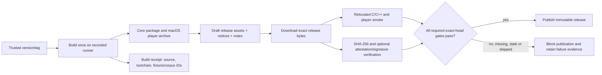

# Phase GB-06: Qualified DMG Release and Consumer Handoff - Research

**Researched:** 2026-10-08  
**Domain:** CMake package delivery, GitHub Actions release provenance, macOS distribution, emulator evidence and native integration  
**Confidence:** MEDIUM

<user_constraints>
## User Constraints (from CONTEXT.md)

### Locked Decisions

### Version, release identity, and macOS trust
- Use the existing CMake project version (`0.1.0` at discussion time) as the product version source and use matching `v<version>` tags. Keep generated release metadata tied to that version, exact source commit, build/toolchain identity, fixture/corpus revision, and artifact SHA-256.
- Publish one durable GitHub Release with platform assets, SHA-256 manifest, notices, release notes, and a concise support/limitations sidecar. Temporary Actions artifacts remain preview evidence, not product releases.
- Prefer GitHub immutable releases and artifact attestations where enabled and verifiable. Create a draft candidate, build once from the clean, trusted exact tag, attach the resulting assets, download and smoke those exact bytes, and publish only after every required gate passes. Never rebuild after the bytes have been qualified.
- Use release-please manifest mode for the version/release PR flow, pinned to a full action commit SHA. It is one narrowly scoped workflow dependency; do not add release/build dependencies to the C core or expand the runtime dependency tree. A scoped GitHub App token is preferred only if one is provisioned. Otherwise preserve GitHub’s approval requirement for CI triggered by a `GITHUB_TOKEN`-created PR and record that operational gate; a manual dispatch is not a replacement for required PR checks.
- The current player artifact is a macOS arm64 CLI tarball. Claim Developer ID signing or notarization only after the exact distributed artifact and its contents pass the applicable Apple verification. If credentials or a suitable distributable are unavailable, label it unsigned and document the actual launch limitation. Do not imply signing from a successful build or tell adopters to disable Gatekeeper globally.

### Package and host/compiler support
- Verify relocated installed C and C++ consumers against `GabbaBoy::core`, with no SDL or private build-tree dependency, on the tested Linux x64 (Ubuntu 22.04), macOS arm64 (macOS 14), and Windows x64 (Windows 2022) runner combinations. Add Windows relocated-package coverage if the existing package workflow does not yet provide it.
- Release the SDL3 player only for the currently tested macOS arm64 configuration. Record actual compiler, CMake, runner image, and build configuration observed by each run. Runner labels and observed OS versions are evidence for those combinations, not promises of minimum OS versions or all architectures.
- Reuse the existing CMake install/export, relocation verifier, consumer programs, and package smoke. Do not add vcpkg, Conan, Homebrew, an installer framework, a C++ wrapper, or a stable ABI promise in this phase.

### Native consumer and Playstead handoff
- Provide a small, runnable C consumer that uses the relocated installed package. It should demonstrate legal fixture loading, bounded half-dot execution, timestamped input, caller-owned frame/audio output, and the host’s explicit battery import/export responsibility. Compile and run it from outside the source/build tree as part of package qualification.
- Document how this native seam could map into a future Playstead GB adapter. The currently inspected Playstead adapter is a GBA/mGBA external-process integration, not a live GabbaBoy Game Boy integration. State that distinction plainly and do not edit the sibling project, add a Swift bridge, or invent a new process protocol here.
- Keep adopter documentation aligned with current ownership, time/input/output, save recovery, support scope, upgrade, and troubleshooting behavior. Prefer concise examples using existing APIs over a new abstraction layer.

### Compatibility, performance, and safety evidence
- Publish a versioned support ledger tied to the release source and fixture/corpus revisions. Name the boot profile, modeled DMG revision, supported cartridge scope, exact eligible corpus, executed denominator, failures, exclusions and known issues. The three currently eligible derived CPU/timer cases are a small scoped corpus, not a game-compatibility percentage. Preserve the distinction between software-model evidence, source-derived expectations, and physical observations; there are no physical DMG, broad game-library, or perceptual claims.
- Reuse fixed project fixtures and project-owned measurement harnesses. Record workload/configuration, build type, compiler, runner/hardware and OS, output digest, warm-up, raw samples, trace/no-trace pairing, memory/allocation scope, and uncertainty. Keep initial numbers advisory; set budgets only after repeated measurements characterize variance. Trace-on/off runs must preserve the same correctness digest.
- Keep the measurement and fuzz toolchain small. Add no Google Benchmark or third-party fuzz library by default. Retain deterministic battery/API regression coverage, add bounded loader and stateful battery/API fuzz targets using compiler-integrated libFuzzer when supported, and run them with applicable sanitizers. Fast CI should run bounded deterministic seeds and regression reproducers; longer fuzz exploration can run separately. Every minimized finding becomes a fast deterministic regression. Explicitly bound input, execution, and memory.
- Boundary regressions must check overflow, truncation, allocation/work limits, and failed-operation atomicity at ROM, save, and public API edges. Do not treat fuzz duration or corpus size as correctness proof.

### Release automation, CI security, and failure behavior
- Re-read current repository rules before implementation. At discussion time, `main` used strict required contexts `required-native`, `fixture-repro`, and `preview-package-smoke`; confirm each status on the exact current PR head and verify merge eligibility instead of relying on this snapshot.
- Run release automation only from trusted repository/tag paths with least-privilege job permissions and full-SHA-pinned actions. Never use `pull_request_target` to check out or execute untrusted PR code. Missing, stale-SHA, skipped, cancelled, timed-out, or failing required evidence blocks release publication.
- Build and qualify final release bytes without depending on a cache. The repository had no configured Actions cache at discussion time; keep the release lane cache-free unless measured need justifies adding a trusted cache with immutable inputs and explicit hit/miss evidence. A cache hit is never proof of a valid artifact.
- Smoke the extracted final macOS package at a relocated path using the original legal fixture and MBC1 continuation fixture, scripted video/audio backends, and fresh processes. Exercise load, input, visible-frame production, PCM delivery, save, exit, and reopen. Record that dummy SDL devices establish software-path behavior only, not physical device or perceptual quality.
- Preserve exact-head bot CI behavior: verify a release/version PR actually receives every required check. Prefer the scoped GitHub App token if configured; otherwise use the documented approval gate for token-created PR runs. Never use a broad personal token or skip protection to make automation appear green.

### Interface and dependency restraint
- Keep the existing simple player and command-line help. Phase 6 is primarily packaging, evidence, and handoff; make only targeted usability or documentation changes that close a stated adopter need. No new UI framework.
- Follow the project preference for small, flat dependency trees. A pinned release orchestration action is justified only for repeatable release versioning; measurement and fuzz harnesses should remain project-owned or compiler-provided unless concrete evidence shows a missing capability.

### the agent's Discretion
- Choose the smallest package manifest/sidecar format that can be validated and consumed without duplicating the version, source SHA, artifact digest, or fixture identity inconsistently.
- Select fixed legal workloads and practical bounded fuzz durations after inspecting existing fixtures, CTest inventory, and CI time variance; record rationale and observed variability.
- Choose the precise documentation placement and the smallest script or C example structure that fits existing project patterns. Keep the decisions above fixed and stop if implementing them would require an unprovisioned credential, inaccessible signing identity, or an inaccurate claim.

### Deferred Ideas (OUT OF SCOPE)
- CGB and additional mapper/revision support, including MBC1M, RTC, save states, and broad game-library compatibility.
- Live Playstead Game Boy integration, Swift bindings, or a new process protocol; the current adapter is GBA/mGBA.
- Stable ABI, libretro, package-manager publication, app bundle/installer/store distribution, or universal binaries.
- Physical DMG testing, perceptual audio/video judgments, device hotplug qualification, and stronger claims than available evidence supports.
- Third-party benchmark or fuzz frameworks, telemetry, and fixed performance budgets before repeated measurements characterize variance.
</user_constraints>

<phase_requirements>
## Phase Requirements

| ID | Description | Research Support |
|----|-------------|------------------|
| SHIP-01 | Clean, relocated release packages build and run external C/C++ consumers on the claimed host/compiler matrix, with no accidental private or SDL dependency in the core export. | Reuse package export and relocation verifier; add Windows installed-consumer package evidence if its absence is confirmed; report actual run compiler and OS. |
| SHIP-02 | A packaged macOS player passes an automated load/input/video/audio/save/exit/reopen smoke using legal fixtures, and any remaining perceptual or device limitations are documented separately. | Extend existing extracted-package player script and scripted SDL smoke; keep dummy-backend result distinct from physical/perceptual evidence. |
| SHIP-03 | The release workflow qualifies the exact downloaded artifact bytes against source revision/version/digests and ships notices and release notes; signing/notarization is claimed only when actually configured and verified. | Draft-build-once-download-verify-publish flow, immutable release/attestation verification, SHA manifest, Apple checks only on final bytes. |
| SHIP-04 | An adopter can follow current build, API ownership/time/input/output, integration, save recovery, support, upgrade, and troubleshooting documentation, including a reproducible Playstead-oriented native consumer example and an honest live-integration status. | Build an installed-package C example from the existing API; align docs to header/save/player contracts; describe Playstead seam and current GBA/mGBA boundary. |
| SHIP-05 | The release support ledger names the DMG revision, boot profile, mapper scope, corpus revision, executed eligible denominator, failures/exclusions, and known issues; CPU/image pass rates are not presented as all-game compatibility. | Tie versioned ledger to source and fixture/corpus identities; current eligible CPU/timer set is three derived cases; enumerate known evidence limits and all excluded cases. |
| SHIP-06 | Reproducible fixed-workload runs establish initial speed, memory/allocation, trace overhead, build, and CI baselines with output digests, samples, environment, and uncertainty; performance budgets follow measured variance and never trade correctness for score. | Reuse existing measurement receipt style; pair trace/no-trace output digests and report raw samples/environment/variance; keep initial values advisory. |
| SHIP-07 | Meaningful loader/battery/API fuzz targets and boundary regressions run under applicable sanitizers with bounded resources; minimized findings join fast regression coverage while longer exploration runs separately. | Existing seeded battery API CTest plus Clang libFuzzer model; add loader and stateful battery/API inputs with bounds, ASan/UBSan and deterministic regression replay. |
| SHIP-08 | Required PR checks, bot-triggered CI, merge eligibility, release triggering, cache behavior, and failure propagation are exercised on the target repository; no stale revision, skipped required lane, or untrusted privileged execution can authorize publication. | Current branch protection snapshot and GitHub token semantics require exact-head status gate, bot PR approval or scoped App token, fail-closed lanes, trusted release trigger, and cache-free bytes. |
</phase_requirements>

## Summary

The phase should assemble release proof from existing pieces rather than add a packaging framework. The core is already an exported CMake target, and the repo already has C/C++ consumers, an installed-package relocator, a macOS SDL tarball verifier, fail-closed test inventory, battery boundary coverage, and an audio measurement receipt. The native workflow already installs the Windows package and the CTest inventory includes relocated package/C/C++ smoke on that runner. The remaining question is whether the release should publish a Windows archive and qualify the downloaded release bytes there; don't add another native consumer lane unless the actual release-asset path needs it. [VERIFIED: `CMakeLists.txt:23-30,86-119`; `.github/workflows/ci.yml:52-82`; `tests/CMakeLists.txt:258-295`; `tests/expected-tests.txt:123-128`; `cmake/PreviewPackageSmoke.cmake:63-111`; `tests/scripts/verify-phase3-player.sh:28-54`; `tests/scripts/measure-audio-playback.sh:60-78`]

Release qualification must bind one version/tag to one clean source SHA, fixture/corpus revision, recorded toolchain, final archive digest, and smoke receipt. Build the candidate once from a trusted exact tag, download and test the final bytes, and publish only after all current required checks succeed. GitHub immutable releases lock tag and assets after publication, and GitHub attestations provide verifiable provenance links; neither an attestation nor a green build alone establishes emulator correctness. [CITED: https://docs.github.com/en/code-security/concepts/supply-chain-security/immutable-releases; https://docs.github.com/en/actions/concepts/security/artifact-attestations]

For the player, Apple notarization claims require Developer ID signing and verification of the final distributed contents. If the required project credential and applicable signed format cannot be confirmed, explicitly ship/report unsigned and document the observed launch limitation. Current local tools include `codesign` and `notarytool`, but the environment probe does not establish a suitable project identity or automation credential; the local libFuzzer linker probe also fails. [CITED: https://developer.apple.com/documentation/security/notarizing-macos-software-before-distribution; https://developer.apple.com/documentation/security/customizing-the-notarization-workflow] [VERIFIED: local availability probe, 2026-10-08]

**Primary recommendation:** Extend the current CMake and script-based release path; keep the core package free of SDL and runtime additions, and treat every claim as a receipt attached to the exact release bytes and candidate SHA.

## Architectural Responsibility Map

| Capability | Primary Tier | Secondary Tier | Rationale |
|------------|-------------|----------------|-----------|
| C/C++ package export and installed consumer | Build / distribution | API / backend | CMake installs the core target; external consumers verify its public surface independently from the source tree. |
| Player archive and SDL runtime | Distribution adapter | Browser / client — | Host UI/audio and package dependencies live in the optional macOS adapter, not the core export. |
| Release metadata, provenance and publication | CI / release automation | Distribution | Workflow binds trusted tag and build to final bytes, reports, and release assets. |
| Compatibility support ledger | API / backend evidence | Documentation | Model/corpus applicability belongs to core test receipts; docs summarize that evidence with exclusions. |
| Performance and fuzz evidence | Core test/tooling | CI | Harnesses drive bounded core operations; CI controls reproducibility, sanitizer configuration and report capture. |
| Native Playstead integration seam | API / backend | Host adapter | Existing C API is the future integration boundary; this phase provides an example, not a live sibling-project feature. |

## Project Constraints (from AGENTS.md)

- Target Game Boy/Game Boy Color and do not claim unimplemented behavior; current product is limited DMG. [VERIFIED: `AGENTS.md:3-5`]
- Use OpenGSD; stop at the phase boundary, keep automatic advance disabled, and report evidence plus the concrete next command. [VERIFIED: `AGENTS.md:7-14`]
- Use phase branches/PRs where remote exists, require reviewed tested exact-head checks, never infer remote green from local/skipped/stale results, and preserve main releasability. [VERIFIED: `AGENTS.md:15-17`]
- Keep the portable C core explicit and instance-owned; host timing, filesystem, UI/audio device and configuration remain adapters. [VERIFIED: `AGENTS.md:19-22`]
- Add performance complexity only after measured evidence; record revision, build, host, workload, model, digest, warm-up, samples and uncertainty. [VERIFIED: `AGENTS.md:23`]
- Test ROM/save/state/public boundaries for overflow, truncation, excess work/allocation and failure atomicity; serialize portably rather than dumping C structs. [VERIFIED: `AGENTS.md:24`]
- Distinguish hardware observation, oracle, metamorphic, regression and private-game evidence; document fixture rights/digests and do not add boot ROMs/commercial ROMs/unlicensed homebrew/private data/mandatory telemetry. [VERIFIED: `AGENTS.md:25-27`]
- Keep `.env.local` ignored, do not publish personal workstation/account/secrets, and use privacy-safe Git identity for project automation. [VERIFIED: `AGENTS.md:27`]
- Do not call a phase complete from documents, test listings, or plausible-looking audiovisual output alone. [VERIFIED: `AGENTS.md:33`]

## Standard Stack

### Core

| Library / tool | Version | Purpose | Why Standard |
|----------------|---------|---------|--------------|
| CMake install/export and `CMakePackageConfigHelpers` | Existing CMake project minimum 3.25; floor CI uses 3.25.3 | Relocatable `GabbaBoy::core` package for C and C++ consumers | Already used in project; official helper docs recommend `configure_package_config_file()` for relocatable config files. No new core dependency. Source quote: “`cmake_minimum_required(VERSION 3.25)`”; floor preset quote: “`{ \"name\": \"cmake-3.25.3\"`”. [VERIFIED: `CMakeLists.txt:1-2`; `CMakePresets.json:4-8`; CITED: https://cmake.org/cmake/help/latest/module/CMakePackageConfigHelpers.html] |
| CTest + existing exact inventory verifier | Repo-defined | Fail-closed unit, package and regression checks | Existing verifier rejects missing reports, failures, skips and inventory drift rather than accepting a successful empty/filter run. [VERIFIED: `.github/scripts/verify-test-inventory.sh:12-44`] |
| Clang libFuzzer + ASan/UBSan | Use compiler-matched runtime where available | Bounded loader and stateful battery/API fuzz exploration | LLVM documents compiler-integrated target and sanitizer pairing; no third-party fuzz package needed. [CITED: https://llvm.org/docs/LibFuzzer.html] |
| GitHub Actions | Existing full-SHA-pinned action model | Cross-platform native checks, package/release, metadata and attestations | Existing workflows already use explicit runner labels and pinned actions; GitHub states full-length SHA is immutable action reference. [VERIFIED: `.github/workflows/ci.yml:12-18,32-38,52-58`; CITED: https://docs.github.com/en/actions/reference/security/secure-use] |

### Supporting

| Library / tool | Version | Purpose | When to Use |
|----------------|---------|---------|-------------|
| SDL3 | 3.4.18 exact pin | Optional macOS player runtime in tar package | Player packaging/smoke only; core export must not link SDL. Source quote: “`find_package(SDL3 3.4.18 EXACT CONFIG REQUIRED)`”; package script quote: “`SDL_VERSION=\"3.4.18\"`”. [VERIFIED: `CMakeLists.txt:63-79`; `tests/scripts/verify-phase3-player.sh:4-8`] |
| `release-please-action` | Pin exact reviewed full commit SHA at implementation | Manifest-based version PR/tag flow | The phase context explicitly permits this single release automation dependency. Verify upstream repo/tag-to-SHA before adopting; do not copy mutable `@v4` into workflow. [CITED: https://github.com/googleapis/release-please-action; https://docs.github.com/en/actions/reference/security/secure-use] |
| Apple `codesign`, `notarytool`, `stapler`, `spctl` | Xcode toolchain | Validate signature/notarization state where provisioned | Only claim for exact release binary/archive that passes relevant signature and notarization validation. [CITED: https://developer.apple.com/documentation/security/customizing-the-notarization-workflow] |
| GitHub CLI `gh` | Runner-provided; record observed version | Exact-head checks and optional attestation verification | Use on trusted CI/release path; don't let CLI success substitute source SHA and required lane comparisons. [CITED: https://docs.github.com/en/actions/how-tos/secure-your-work/use-artifact-attestations/use-artifact-attestations] |

### Alternatives Considered

| Instead of | Could Use | Tradeoff |
|------------|-----------|----------|
| Existing CMake export and C/C++ consumers | vcpkg, Conan, Homebrew, installer framework | Adds ecosystem/package-manager dependency and crosses the locked scope; current install/export supports target consumer validation already. [VERIFIED: `CMakeLists.txt:86-119`; CONTEXT.md locked decision] |
| Project measurement harness and CTest receipts | Google Benchmark | Third-party benchmark framework does not replace workload identity, output digest, raw samples or noise analysis; prohibited by default in locked decisions. [VERIFIED: `tests/scripts/measure-audio-playback.sh:60-78`; CONTEXT.md locked decision] |
| Compiler-integrated libFuzzer | Third-party fuzz library | Additional package dependency unnecessary where matching Clang runtime is available; use deterministic CTest seeds on platforms without the fuzzer runtime. [CITED: https://llvm.org/docs/LibFuzzer.html] |
| CLI tarball with truthful trust state | App bundle, DMG installer, store publication or universal binary | These distribution formats and claims are deferred; macOS artifact remains arm64 CLI tar.gz. [VERIFIED: `tests/scripts/verify-phase3-player.sh:56-60`; CONTEXT.md deferred ideas] |

**Installation:** No new core/runtime package install is recommended. `release-please-action` is the one narrowly scoped workflow action dependency, pinned to a full upstream commit SHA after verification. There is no npm/PyPI/crates package legitimacy audit to run for this workflow action or project-owned scripts.

The exported core is a static C17 library; source quote: “`add_library(gabbaboy_core STATIC src/core/gabbaboy.c)`”, “`target_compile_features(gabbaboy_core PUBLIC c_std_17)`”, and “`set_target_properties(gabbaboy_core PROPERTIES EXPORT_NAME core)`”. [VERIFIED: `CMakeLists.txt:23-30`]

## Package Legitimacy Audit

| Package | Registry | Age | Downloads | Source Repo | Verdict | Disposition |
|---------|----------|-----|-----------|-------------|---------|-------------|
| None | — | — | — | — | N/A | No package-manager dependency is introduced; release automation is a GitHub Action and must be pinned/reviewed per GitHub SHA guidance. |

**Packages removed due to [SLOP] verdict:** none  
**Packages flagged as suspicious [SUS]:** none

## Architecture Patterns

### System Architecture Diagram



### Recommended Project Structure

Extend existing locations rather than create a generic release framework: keep workflows with `.github/workflows/`, package and fixture verification under `cmake/` and `tests/scripts/`, public C example with existing external consumers, and adopter-facing evidence in `docs/` referenced by README. Existing source evidence anchors: `CMakeLists.txt:86-119`, `.github/workflows/ci.yml:117-180`, `cmake/PreviewPackageSmoke.cmake:63-111`, `tests/consumers/c/main.c`, and `tests/scripts/verify-phase3-player.sh:56-160`. [VERIFIED: cited repository lines]

### Pattern 1: Relocated package consumer

**What:** Install to a staging prefix, archive/extract that prefix at a different path, reject source/build paths, then separately configure/build/run public C and C++ consumers using the extracted prefix. Ensure the core import target is the only dependency and never pass private include directories. [VERIFIED: `cmake/PreviewPackageSmoke.cmake:63-111`; `CMakeLists.txt:23-30,96-119`]

**When to use:** Every supported OS/compiler combination claimed for core package consumption. The locked matrix is Linux x64 Ubuntu 22.04, macOS arm64 macOS 14, Windows x64 Windows 2022; capture actual compiler, CMake and configuration from each run. Native CI installs all three; Windows prepares a test install prefix, runs the installed inventory and captures manifest bytes. `preview-package-smoke` publishes only Linux and macOS temporary preview archives, so implement Windows release-archive download testing only if the release plan publishes that asset. [VERIFIED: `.github/workflows/ci.yml:12-82`; `.github/workflows/preview.yml:15-85`; `tests/CMakeLists.txt:258-295`; CONTEXT.md:25-28]

**Example:** The current verifier's exact sequence is “`COMMAND "${GBB_CMAKE_COMMAND}" -S "${source_dir}/tests/consumers/${language}"`”, then “`-DCMAKE_PREFIX_PATH=${extracted_prefix}`”, then “`execute_process(COMMAND "${consumer}" "${extracted_prefix}/share/gabbaboy/fixtures/tracer/tracer.gb"`”. These are the present relocated compile/run boundaries. [VERIFIED: `cmake/PreviewPackageSmoke.cmake:76-110`]

### Pattern 2: One-build release evidence chain

**What:** Bind version and tag, exact source SHA, clean-tree result, toolchain/runner/build config, fixture/corpus manifest identities, package SHA-256, downloaded-byte smoke result, notices and release notes into one validated receipt/sidecar. Create the GitHub Release as draft, attach assets, qualify downloaded assets, then publish without rebuilding. GitHub recommends draft/attach/publish for immutable releases; after publication tags/assets lock. [CITED: https://docs.github.com/en/code-security/concepts/supply-chain-security/immutable-releases]

**When to use:** Final release and any release candidate intended for publication. Temporary Actions artifact is still preview evidence. [VERIFIED: `.planning/phases/GB-06-qualified-dmg-release-and-consumer-handoff/06-CONTEXT.md:18-23`]

**Example:** Current package verification rejects a nonpassing receipt, mismatch between the receipt SHA and expected source revision, dirty exact-release source, or archive digest mismatch, then extracts and smoke-runs the package. Extend the receipt so final release verification includes the same assertions after download. [VERIFIED: `tests/scripts/verify-phase3-player.sh:28-54,56-98`]

### Pattern 3: Bounded compiler-integrated fuzzing

**What:** Keep ordinary deterministic boundary cases in CTest and make a separate Clang libFuzzer target with a seeded corpus, input-length cap, bounded guest ticks, and explicit run/time/RSS limits. Pair with ASan/UBSan where matching runtime is supported. LLVM identifies libFuzzer as in-process coverage-guided, compiler-integrated, supports ASan/UBSan, and provides maximum-length/time options. [CITED: https://llvm.org/docs/LibFuzzer.html]

**When to use:** Untrusted ROM input and stateful public battery/API operation sequences. Preserve a bounded test corpus path in fast CI; longer exploration is scheduled/manual and must not replace regression tests. [VERIFIED: `tests/test_battery_fuzz.c:6-10,41-154`; `.github/workflows/ci.yml:84-105`]

**Example:** For libFuzzer, implement `extern "C" int LLVMFuzzerTestOneInput(const uint8_t *data, size_t size)` (C target uses ordinary C linkage), reject over-cap inputs before allocation, and invoke operations only with a bounded emulated-work budget. LLVM documents the target signature and separate `-max_len`, `-runs`, and `-max_total_time` bounds. [CITED: https://llvm.org/docs/LibFuzzer.html]

### Anti-Patterns to Avoid

- **Release on build success:** Build success does not qualify final asset bytes or consumer behavior. Hash and test the downloaded asset itself; never rebuild after qualification. [CITED: https://docs.github.com/en/code-security/concepts/supply-chain-security/immutable-releases]
- **Mutable release workflow reference:** Pin Actions to full commit SHA; GitHub documents it as the immutable action reference. [CITED: https://docs.github.com/en/actions/reference/security/secure-use]
- **Privileged PR execution:** Do not checkout/run PR-controlled code in `pull_request_target`; GitHub warns this event has base-repository write token/secrets by default. [CITED: https://docs.github.com/en/actions/reference/security/securely-using-pull_request_target]
- **Assuming bot PR checks ran:** `GITHUB_TOKEN`-created PR events enter approval-required state; verify required checks on exact PR head and preserve that human approval gate unless a scoped GitHub App token is provisioned. Manual dispatch does not count as a PR status. [CITED: https://docs.github.com/en/actions/concepts/security/github_token]
- **Treating cache hits as artifact proof:** Release flow stays cache-free by decision; content digest and exact source/run binding qualify bytes. [VERIFIED: CONTEXT.md:41-46]
- **Compatibility percentage inflation:** Do not report the small eligible CPU/timer denominator as game compatibility. The current eligible corpus has three derived report closures, names `daa`, `tim00`, and `tim00_div_trigger`; original PPU-dependent paths stay excluded. [VERIFIED: `README.md:140-142`; `.planning/phases/GB-02-dmg-cpu-bus-and-time/02-VERIFICATION.md:90`]
- **Fuzz duration as correctness:** Crashes and minimized reproducers matter; durations/corpus counts cannot prove correctness or fixed hardware behavior. Keep each discovered issue as a deterministic regression. [CITED: https://llvm.org/docs/LibFuzzer.html; CONTEXT.md:35-39]
- **Signing inference:** A valid build or local signing identity is not evidence the exact asset is signed and notarized. Follow applicable Apple validation over the final downloadable contents; otherwise label its trust state accurately. [CITED: https://developer.apple.com/documentation/security/notarizing-macos-software-before-distribution]

## Don't Hand-Roll

| Problem | Don't Build | Use Instead | Why |
|---------|-------------|-------------|-----|
| Relocatable CMake config | Absolute-prefix config or custom package locator | Existing `configure_package_config_file`, exported targets, relocated consumers | Official CMake helper avoids hardcoded install paths; existing project is already wired. [CITED: https://cmake.org/cmake/help/latest/module/CMakePackageConfigHelpers.html; VERIFIED: `CMakeLists.txt:86-119`] |
| Cryptographic release binding | Bespoke signing/attestation protocol | SHA-256 manifest plus GitHub immutable-release/attestation features, with verification | GitHub release attestations bind release tag, commit and assets; artifact attestations support producer/consumer verification but do not promise artifact security. [CITED: https://docs.github.com/en/code-security/concepts/supply-chain-security/immutable-releases; https://docs.github.com/en/actions/concepts/security/artifact-attestations] |
| Fuzz mutation engine | Custom mutation loop or new third-party fuzz framework | Compiler-integrated Clang libFuzzer where available; deterministic CTest regression fallback | Existing battery fuzz is useful bounded sequence regression, not coverage-guided exploration; LLVM provides in-process coverage-guided engine and sanitizer integration. [VERIFIED: `tests/test_battery_fuzz.c:41-154`; CITED: https://llvm.org/docs/LibFuzzer.html] |
| macOS notarization state | Human checklist based on build log or custom ticket substitute | Apple `notarytool`/`stapler` and signature verification, only where credentials/supported artifact permit | Apple documents Developer ID signing and current CLI workflow; final artifact's verification receipt is necessary. [CITED: https://developer.apple.com/documentation/security/customizing-the-notarization-workflow] |

**Key insight:** The main risk is evidence drift between a reviewed source revision and the downloadable bytes. Reuse existing exact-SHA and digest checks, but make the final downloaded release asset—not a build directory, temporary artifact, or earlier tag—the object tested and published. [VERIFIED: `tests/scripts/verify-phase3-player.sh:28-98`; CITED: GitHub immutable releases URL above]

## Common Pitfalls

### Pitfall 1: Qualifying a candidate but publishing different bytes

**What goes wrong:** Release asset is rebuilt, re-packed, or replaced after smoke and digest comparison.  
**Why it happens:** Build artifacts and GitHub release assets are treated as interchangeable names rather than byte identities.  
**How to avoid:** Build once from clean exact tag; capture archive hash; upload draft; download the release asset; compare SHA and receipts; smoke those downloaded bytes; publish without rebuilding.  
**Warning signs:** Sidecar says one hash while API/download reports another; source SHA/version missing; release job builds again after smoke. [CITED: https://docs.github.com/en/code-security/concepts/supply-chain-security/immutable-releases; VERIFIED: existing digest check at `tests/scripts/verify-phase3-player.sh:56-98`]

### Pitfall 2: Required checks missing on bot-created release PR

**What goes wrong:** Release/version PR is mergeable-looking but required workflow hasn't run, or caller assumes dispatch run satisfies the required PR context.  
**Why it happens:** Events from `GITHUB_TOKEN` generally do not recursively start workflows; bot PR `opened`/`synchronize`/`reopened` events wait for approval.  
**How to avoid:** Verify exact PR head, all branch protection contexts, run IDs/event type/conclusion and merge eligibility. Prefer scoped GitHub App token only when provisioned; otherwise document and perform approval.  
**Warning signs:** no check run for one required context, pending status, skipped lane, check attached to a different SHA. [CITED: https://docs.github.com/en/actions/concepts/security/github_token]

### Pitfall 3: Confusing runner labels with support promises

**What goes wrong:** Workflow's runner image is presented as a minimum supported OS, all architecture or compiler claim.  
**Why it happens:** CI observes only one image/toolchain tuple.  
**How to avoid:** Record actual runner image, OS, compiler, CMake, generator and config per result; phrase support as tested combinations, keep player arm64 macOS only. [VERIFIED: CONTEXT.md:25-28; `.github/workflows/ci.yml:12-82`]

### Pitfall 4: Treating dummy SDL tests as device or perceptual proof

**What goes wrong:** Passing automated smoke is described as physical playback, hotplug, audio quality or visual quality.  
**Why it happens:** Software backends establish API path and event behavior, not physical device presentation.  
**How to avoid:** State the smoke covers load/input/frame/PCM/save/reopen software routes, and record physical/perceptual/hotplug limitations separately. [VERIFIED: `docs/audio-and-playback.md:80-96,154-157`; CONTEXT.md:45]

### Pitfall 5: Fuzzer has unbounded guest work or unbounded allocations

**What goes wrong:** A malformed ROM or valid infinite guest stalls hosted fuzz job or exhausts memory.  
**Why it happens:** Input size alone does not bound execution state or per-operation allocations.  
**How to avoid:** Cap input bytes before loader, use bounded API/tick budget, add max input length/run/time/RSS, test zero and boundary lengths, apply sanitizer, and replay every crash as fast regression.  
**Warning signs:** Fuzzer can execute without a maximum duration or API call can scale work with attacker-declared size without validation. [VERIFIED: public API's “2 MiB hard limit” and “An instruction is preflighted and won't start unless its full cost fits.” in `include/gabbaboy/gabbaboy.h:21-24,186-200`; CITED: https://llvm.org/docs/LibFuzzer.html]

## Code Examples

Verified public API shape for the native example; buffer ownership, frame dimensions, audio format, time units, and input timestamp semantics must be documented alongside use. [VERIFIED: `include/gabbaboy/gabbaboy.h:69-73,110-120,122-125,157-185,186-223`]

```c
gbb_input_event event = { .at_half_dots = next_time, .kind = input_kind, .value = input_value };
gbb_error queued = gbb_queue_events(machine, &event, event_count);

gbb_audio_frame frames[capacity];
size_t frame_count;
gbb_run_result result = gbb_run_audio(machine, budget_half_dots,
                                      frames, capacity, &frame_count);
```

The in-repo API's exact profile/status/event constants are quoted verbatim in the source: “`GBB_PROFILE_DMG_CPU_B = 1`”, “`GBB_OK = 0`”, “`GBB_INVALID_ARGUMENT`”, “`GBB_EVENT_QUEUE_FULL`”, “`GBB_INPUT_BUTTON_PRESS = 3`”, “`GBB_INPUT_BUTTON_RELEASE = 4`”; code samples should use only those defined public values. [VERIFIED: `include/gabbaboy/gabbaboy.h:13-36,51-67`]

## State of the Art

| Old Approach | Current Approach | When Changed | Impact |
|--------------|------------------|--------------|--------|
| Mutable tag and mutable attached files as release identity | GitHub can lock tag/assets through immutable releases and emit a release attestation | Current GitHub documented feature; recheck repository setting before enablement | Draft, attach all assets, publish once; consumer can verify exact tag/commit/assets. [CITED: https://docs.github.com/en/code-security/concepts/supply-chain-security/immutable-releases] |
| `altool` / Xcode 13 notarization upload | `notarytool` with current Xcode toolchain; inspect log and staple where supported | Apple says service stopped accepting altool/Xcode 13 or earlier uploads on Nov 1, 2023 | Do not design new automation around the deprecated upload route. [CITED: https://developer.apple.com/documentation/security/notarizing-macos-software-before-distribution; https://developer.apple.com/documentation/security/customizing-the-notarization-workflow] |
| Workflow action version tags | Full 40-character commit SHA reference | Current GitHub secure use docs | Protects action identity from moved tags; verify chosen SHA originates in upstream repository. [CITED: https://docs.github.com/en/actions/reference/security/secure-use] |
| Unbounded background fuzzer | Bounded jobs and fast deterministic reproducer gate | Existing CI plus LLVM current libFuzzer flags | Separate short regression and longer exploration; archive failure seeds with identity and make them deterministic tests. [CITED: https://llvm.org/docs/LibFuzzer.html; VERIFIED: `tests/expected-tests.txt:1-20`]

**Deprecated/outdated:** `altool` and Xcode 13-or-earlier upload route are unsupported by Apple's notary service since 2023-11-01; use current `notarytool` documentation. [CITED: https://developer.apple.com/documentation/security/notarizing-macos-software-before-distribution]

## Assumptions Log

| # | Claim | Section | Risk if Wrong |
|---|-------|---------|---------------|
| A1 | Release workflow can obtain a scoped GitHub App installation token if that credential is provisioned; current credentials/settings must be checked at planning/execution. | Standard Stack / Pitfall 2 | Bot-created version PR may remain approval-gated; attempting another credential without authorization would violate scope. |
| A2 | A matching Apple Developer ID identity and notarization credential usable by release automation have not been established by local tool presence. | Summary / Environment Availability | Incorrect signing claim or release block; safest fallback is unsigned status with observed launch guidance. |
| A3 | Matching Clang libFuzzer runtime is available on target hosted Linux runner even though the current macOS toolchain link probe failed. | Standard Stack / Environment Availability | Must gate on real target compiler/runtime and retain deterministic sanitizer regression fallback. |
| A4 | The three derived CPU/timer closures remain the entire eligible corpus at release planning time. | Compatibility support ledger | Corpus revision/denominator may have changed; regenerate from pinned manifest and report actual execution counts. |

## Open Questions

1. **Can release automation use the scoped GitHub App and Apple signing/notarization credentials?**
   - What we know: `gh` API access here can inspect repository branch rules; local `codesign` and `notarytool` executables exist. Their presence does not establish project-owned usable credentials. [VERIFIED: environment probe]
   - What's unclear: GitHub App installation availability, macOS runner secret/protected environment configuration, valid Developer ID cert identity, account entitlement and suitable artifact path.
   - Recommendation: check repository/org settings and credential availability before planning signing tasks. If unavailable, keep the allowed unsigned/not-notarized state and document actual launch warning; do not block other release work.
2. **Will Phase 6's new release/version PR pass every required exact-head context without manual approval?**
   - What we know: live repository protection was strict with required checks `required-native`, `fixture-repro`, `preview-package-smoke`; remote `main` at `7bde980f6a74d8e0c7d034cfa3283d8f3aa3ff85` showed successful `required-native` and `fixture-repro`; no open PR existed during research; branch aggregate status was pending while `preview-package-smoke` was not present on the push head. [VERIFIED: GitHub REST API queried 2026-10-08; exact strings quoted from response]
   - What's unclear: future release PR's GitHub App token provisioning and approval state.
   - Recommendation: run an actual release PR exercise and require all three context results on exact PR head; don't use current `main` check set or dispatch as a substitute.
3. **Which fixed performance workloads best characterize the phase's baseline?**
   - What we know: project has audio and guest fixtures and existing receipt/provenance pattern; phase context requires speed, memory/allocation, trace overhead and output digests. [VERIFIED: `tests/scripts/measure-audio-playback.sh:60-78`; CONTEXT.md:35-39]
   - What's unclear: variance on each candidate workload across clean repeated CI/local runs.
   - Recommendation: select a small CPU-heavy and visible/audio/battery fixture workload; establish repeat count and uncertainty from pilot runs before setting any regression budget.

## Environment Availability

| Dependency | Required By | Available | Version | Fallback |
|------------|------------|-----------|---------|----------|
| GitHub remote / `gh` | Exact-head policy and release workflow research | ✓ | `gh` installed and authenticated in research environment; avoid exposing identity/token | Use documented REST API/status checks from trusted Actions token. |
| CMake | Package configuration and local consumer validation | ✓ | 4.4.3 | Target matrix records actual runner CMake; existing floor lane checks 3.25.3. |
| Apple signing tools | Optional player trust state | ✓ (tools only) | `notarytool` 1.1.2; `codesign`, `xcrun`, `spctl` present | Ship unsigned with accurate observed launch limitation if suitable credentials/format are absent. |
| Apple Developer ID / notarization credentials | Signing/notarization claim | ? | Not verified; local identity inventory alone doesn't establish project credential | Unsigned/not notarized. |
| Clang libFuzzer runtime | Coverage-guided fuzz target | ✗ local current macOS probe | Apple clang 21.0.1; failing output: `ld: library '/Applications/Xcode.app/Contents/Developer/Toolchains/XcodeDefault.xctoolchain/usr/lib/clang/21/lib/darwin/libclang_rt.fuzzer_osx.a' not found` / `clang: error: linker command failed with exit code 1` | Try matching supported Clang runtime on Linux CI; deterministic seeds + ASan/UBSan regression remain required. |
| macOS/Linux/Windows runners | Claimed host/compiler package matrix | ✓ remotely configured | `macos-14`, `ubuntu-22.04`, `windows-2022` labels | Record actual resolved image/compiler per run; labels alone do not imply minimum OS support. |

**Missing dependencies with no fallback:** none currently; credential gaps have an unsigned release fallback.  
**Missing dependencies with fallback:** local macOS libFuzzer runtime; run fuzzer only on a supported matching toolchain and keep deterministic boundary regressions in CI.

## Validation Architecture

### Test Framework

| Property | Value |
|----------|-------|
| Framework | CTest; repo expected-test inventory validates the actual JUnit set and rejects skip/failure. |
| Config file | `tests/CMakeLists.txt`; repo inventory `tests/expected-tests.txt`. |
| Quick run command | `ctest --preset phase1 --output-on-failure --no-tests=error -R '^(battery_api_fuzz|loader_non_destructive|preview_package_smoke)$'` |
| Full suite command | `mkdir -p build/package-prefix && cmake --preset phase1 -DGBB_TEST_INSTALL_PREFIX="$PWD/build/package-prefix" && cmake --build --preset phase1 && cmake --install build --prefix build/package-prefix && ctest --test-dir build --output-on-failure --no-tests=error --output-junit build/ctest.xml && bash .github/scripts/verify-test-inventory.sh build/ctest.xml tests/expected-tests.txt --installed` |

The test framework and current named cases are defined by existing registrations and inventory; output location and commands above are proposed reusable validation invocations, not evidence that Phase 6 has run. [VERIFIED: `tests/CMakeLists.txt:8-35`; `tests/expected-tests.txt:1-20,120-140`; `.github/scripts/verify-test-inventory.sh:4-44`]

### Phase Requirements → Test Map

| Req ID | Behavior | Test Type | Automated Command | File Exists? |
|--------|----------|-----------|-------------------|-------------|
| SHIP-01 | Relocate final core package, configure/build/run C and C++ consumer outside source/build on Linux/macOS/Windows; assert no SDL/private path | integration / matrix CI | `ctest --test-dir build --output-on-failure --no-tests=error -R '^preview_package_smoke$'` plus native workflow's installed inventory | Existing relocated package and installed C/C++ tests run in the three native CI lanes; add final downloaded-byte verification for any Windows release archive. |
| SHIP-02 | Extract exact downloaded macOS archive and scripted legal-fixture load/input/frame/audio/save/exit/fresh reopen | package integration | `GBB_EXPECTED_SOURCE_REVISION="$EXPECTED_SHA" bash tests/scripts/verify-phase3-player.sh --verify-package "$ARTIFACT_DIR"` | Existing verifier accepts an artifact directory; confirm/extend its current smoke for every phase success step. |
| SHIP-03 | Version/tag/source/toolchain/fixtures/hash match exact release asset; notices/release notes present; trust claims match validated signature state | release workflow integration | `GBB_EXPECTED_SOURCE_REVISION="$EXPECTED_SHA" bash tests/scripts/verify-phase3-player.sh --verify-package "$ARTIFACT_DIR"` plus release receipt/manifest verifier | Existing package receipt/digest patterns; release workflow/sidecar is Wave 0. |
| SHIP-04 | Native example compiles/runs from relocated install and docs match ownership/time/input/output/save/support/upgrade/troubleshooting | installed integration + docs link/claim checks | `ctest --test-dir build --output-on-failure --no-tests=error -R '^preview_package_smoke$'` plus generated/structured doc claims check | Existing package smoke compiles/runs C and C++ consumers; adopter demonstration and Playstead handoff needs add/update. |
| SHIP-05 | Versioned support ledger matches exact source and fixture/corpus, eligible denominator, failure/exclusion details | manifest validator / evidence audit | `cmake -DGBB_EXPECTED_SOURCE_REVISION=<40-char-sha> -P cmake/VerifySupportLedger.cmake` (proposed) | Wave 0 validator and ledger to add; corpus manifest/report exists. |
| SHIP-06 | Reproduce fixed workload speed/memory/allocation/trace/build/CI receipt, digests, samples and uncertainty without correctness drift | reproducibility / measurement | `bash tests/scripts/measure-audio-playback.sh` plus new core workload receipt command | Existing audio receipt; phase-wide throughput/trace/memory runner is Wave 0. |
| SHIP-07 | Bounded loader and battery/API fuzz under ASan/UBSan; replay minimized findings as fast tests | fuzz/sanitizer regression | `ctest --preset phase1-asan --output-on-failure --no-tests=error -R '^(battery_api_fuzz|loader_.*)$'`; separate Clang fuzz command with max length/time/RSS | battery bounded fuzz exists; loader fuzz, libFuzzer target, seed corpus/minimized reproducers to add. |
| SHIP-08 | Bot PR receives exact required contexts; release trigger/gates/cache/failure paths reject stale/skipped/untrusted results | hosted workflow integration | `gh run view <run-id> --json conclusion,headSha,event,jobs` plus release-gate verifier and API-based merge eligibility check | Current CI and preview gate patterns exist; release-specific end-to-end exercise is Wave 0. |

### Sampling Rate

- **Per task commit:** relevant focused CTest/API verifier. Keep tests fast and deterministic.
- **Per wave merge:** full CTest exact inventory and package/fixture gates applicable to the wave.
- **Phase gate:** exact candidate PR has all required hosted contexts, no skipped required lanes, verified downloaded asset receipts, and every support/measurement claim maps to artifact output.

### Wave 0 Gaps

- [ ] Release receipt/manifest schema and verifier that binds version, tag, source SHA, build metadata, fixture/corpus IDs, archive SHA, and downloaded-byte smoke result.
- [ ] Final downloaded-byte verification for a Windows core release archive if Windows is among the published core assets; current native CI already checks installed/relocated Windows consumers.
- [ ] Small runnable installed C example covering timestamped input, half-dot budget, frame/audio buffers, and host battery ownership.
- [ ] Package smoke for final macOS exit/reopen in fresh processes plus input, frame, PCM and save path with legal fixtures.
- [ ] Support ledger and structural validator tied to exact corpus/fixture manifests.
- [ ] Fixed core benchmark receipt for speed, memory/allocation and trace/no-trace pairing; record pilot variance before any budget.
- [ ] Clang libFuzzer loader/stateful API targets plus bounded CI seed/reproducer command; keep existing deterministic suite.
- [ ] Release workflow trigger/auth/cache/failure-propagation integration exercise on actual target repository and exact PR head.

## Security Domain

The project enables security enforcement and ASVS level 1. Exact config quote: `"security_enforcement": true` and `"security_asvs_level": 1`. ASVS 5.0 renumbers several categories versus older 4.x; use the current ASVS 5.0 taxonomy when writing checks. OWASP describes the standard as a basis for testing security controls; it does not make this desktop library a web app. [VERIFIED: `.planning/config.json:48-49`; CITED: https://owasp.org/projects/asvs?tab=get-involved; https://cornucopia.owasp.org/taxonomy/asvs-5.0]

### Applicable ASVS Categories

| ASVS 5.0 Category | Applies | Standard Control |
|-------------------|---------|------------------|
| V1 Encoding and Sanitization | yes | Safely quote or pass untrusted values as action inputs/arguments; never concatenate PR titles, paths, tag text or metadata into shell scripts. |
| V2 Validation and Business Logic | yes | Reject malformed/mismatched release metadata, hashes, sizes, fixture identity and expected status before publication. |
| V3 Web Frontend Security | no | No browser-facing product UI in scope. |
| V4 API and Web Service | conditional | GitHub API/CLI workflow only; use least-privilege token and validate exact run SHA/event/result. |
| V5 File Handling | yes | Safe archive extraction, path traversal/symlink rejection and bounded package/fuzz input. |
| V6 Authentication | conditional | GitHub App/GITHUB_TOKEN and Apple signing credentials remain workflow secrets; no end-user authentication. |
| V7 Session Management | no | No end-user session service. |
| V8 Authorization | yes | Repository/environment rules, protected publication job, branch protection and least-privilege release permissions. |
| V11 Cryptography | yes | SHA-256 for artifact identity; use GitHub/Apple signature/attestation mechanisms, never custom crypto. |
| V12 Secure Communication | yes | GitHub/Apple hosted endpoints via TLS; do not embed credentials in scripts or artifacts. |
| V13 Configuration | yes | Fail closed on missing/reused secrets, immutable tag settings, missing required contexts or absent event trust. |
| V14 Data Protection | yes | Sanitize artifacts; never expose local home paths, usernames, keychain data, tokens or private ROMs. |
| V15 Secure Coding and Architecture | yes | Keep C parser/fuzzer operations bounded and release builder isolated from untrusted PR code. |
| V16 Security Logging and Error Handling | yes | Record run IDs/SHA/status and actionable gate failures; avoid secrets and do not convert failure/skip/timeout to pass. |

### Known Threat Patterns for CMake/GitHub Actions/macOS distribution

| Pattern | STRIDE | Standard Mitigation |
|---------|--------|---------------------|
| Malicious PR code executed with release secrets/write token | Elevation of Privilege | `pull_request` for untrusted tests; never checkout or execute PR content under `pull_request_target`. |
| Version/tag or asset points to different bytes than qualified build | Tampering | Clean trusted tag, source SHA/build receipt, SHA-256 downloaded archive compare, immutable release, verify attestation where enabled. |
| Stale or skipped required check accepted as current | Tampering / Repudiation | Query exact candidate head SHA, run event, required context and conclusion; gate all missing/stale/skipped/cancelled/timed out as failure. |
| Archive traversal or symlink escapes extraction root | Tampering / Elevation of Privilege | Existing safe extractor and relocated isolated temp root; adversarial path, link, size and count regression cases. |
| Fuzzer exhausts RAM or CPU | Denial of Service | Bound bytes, allocation/work, tick budget, max input length, runtime, RSS and parallel jobs. |
| Signature state overstated or modified contents invalidates signature | Spoofing / Tampering | Verify final binary and archive contents after last modification; run Apple tooling and preserve notarization log/ticket when applicable; report unsigned if not verified. |
| Secret/home path leaks via release sidecar/build receipt | Information Disclosure | Allowlist metadata fields; redact logs; privacy-safe author; scan public outputs for personal paths/secrets. |

## Sources

### Primary (official documentation; MEDIUM provider confidence)

- LLVM libFuzzer documentation — target shape, seed corpus, sanitizer pairing, and bounded run options: https://llvm.org/docs/LibFuzzer.html (provider confidence MEDIUM, official primary documentation).
- GitHub immutable releases — tag/asset immutability and draft-attach-publish pattern: https://docs.github.com/en/code-security/concepts/supply-chain-security/immutable-releases (provider confidence MEDIUM, official primary documentation).
- GitHub artifact attestations — claims and consumer verification model: https://docs.github.com/en/actions/concepts/security/artifact-attestations (official primary documentation).
- GitHub secure use, `pull_request_target`, and token behavior: https://docs.github.com/en/actions/reference/security/secure-use; https://docs.github.com/en/actions/reference/security/securely-using-pull_request_target; https://docs.github.com/en/actions/concepts/security/github_token (official primary documentation).
- Apple notarization workflow: https://developer.apple.com/documentation/security/notarizing-macos-software-before-distribution; https://developer.apple.com/documentation/security/customizing-the-notarization-workflow (official primary documentation).
- CMake package helpers: https://cmake.org/cmake/help/latest/module/CMakePackageConfigHelpers.html (official primary documentation).
- Release Please action manifest usage: https://github.com/googleapis/release-please-action (upstream repository documentation; action commit pin must be verified before use).
- Local source of truth: `AGENTS.md`, `.planning/REQUIREMENTS.md`, `.planning/phases/GB-06-qualified-dmg-release-and-consumer-handoff/06-CONTEXT.md`, `CMakeLists.txt`, current workflow/verifier scripts and public header. Discrete source values have exact file/line citations at point of use.

### Secondary (MEDIUM confidence)

- OWASP ASVS 5.0 categories: https://cornucopia.owasp.org/taxonomy/asvs-5.0 and https://owasp.org/projects/asvs?tab=get-involved (official OWASP project material; phase config supplies required level).
- GitHub repository branch protection and current `main` checks queried using authenticated read-only API on 2026-10-08; snapshot is operational evidence only and must be rechecked on each exact PR head.

### Tertiary (LOW confidence)

- None used for adopted recommendations. Open credential/tool availability questions remain listed explicitly.

## Metadata

**Confidence breakdown:**
- Standard stack: MEDIUM — existing project patterns opened in source and official CMake/LLVM docs checked; versioned action SHA remains for implementation-time verification.
- Architecture: MEDIUM — release flow follows official GitHub/Apple docs and current repo verification seams; target repository credential/settings may change.
- Pitfalls: MEDIUM — exact-head/token and signing claims use official docs; the current live branch-protection snapshot is not permanent.

**Research date:** 2026-10-08  
**Valid until:** 2026-11-07 for stable CMake/API architecture; recheck GitHub repository protection, Action SHA, hosted runner images, Apple credentials/signing policy and provider behaviors immediately before implementation/release.
